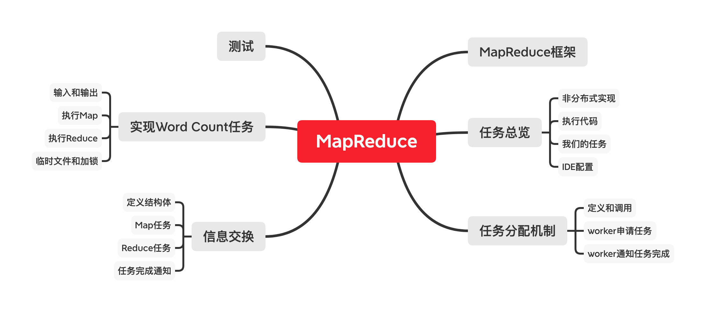
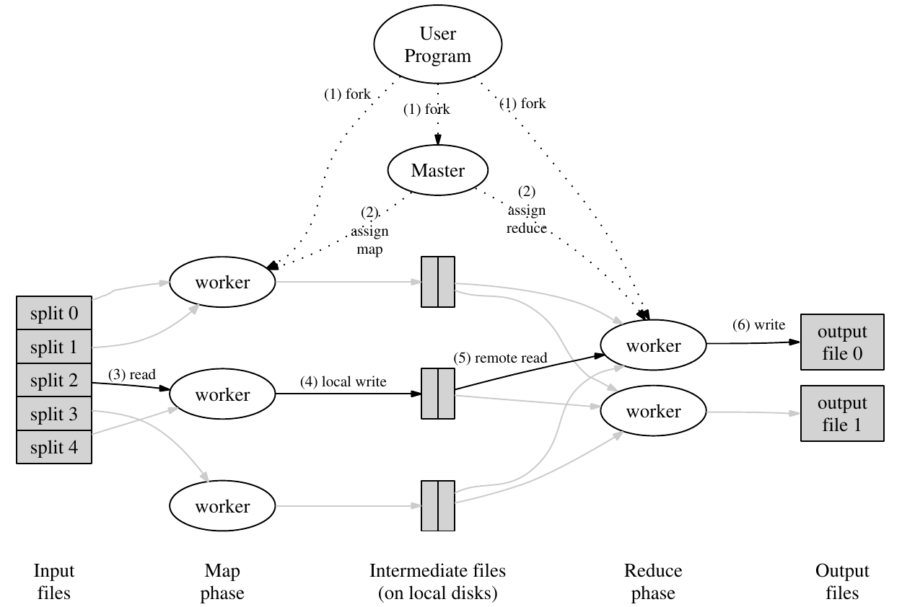
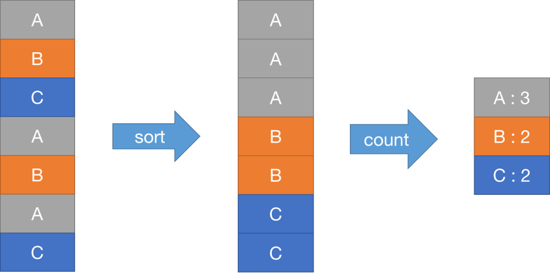
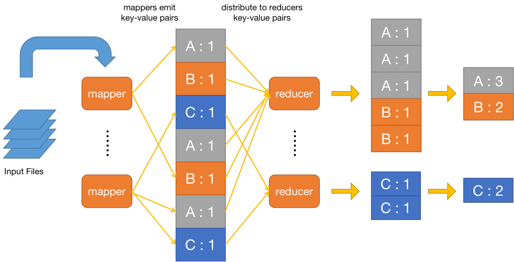
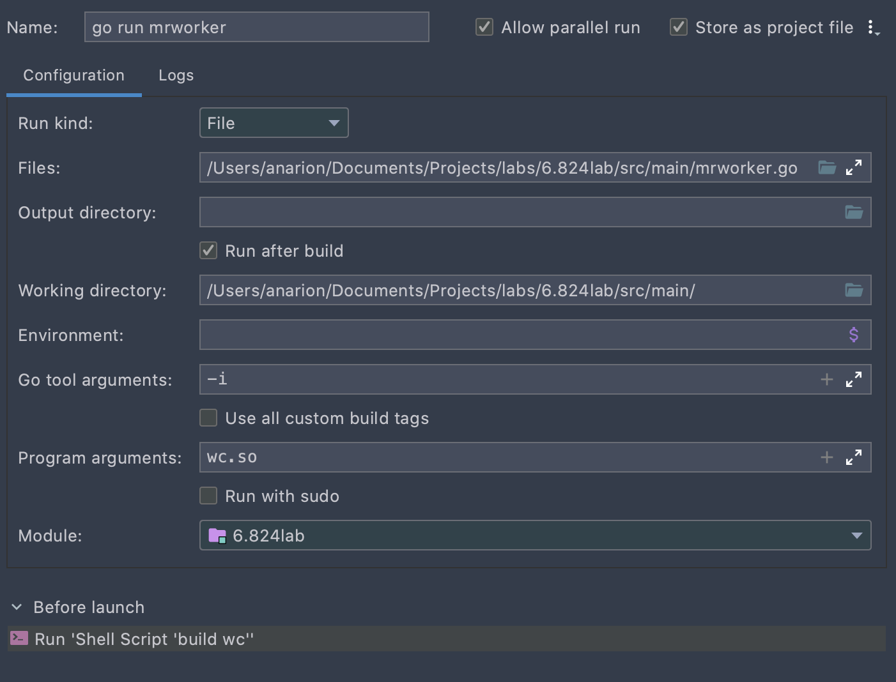
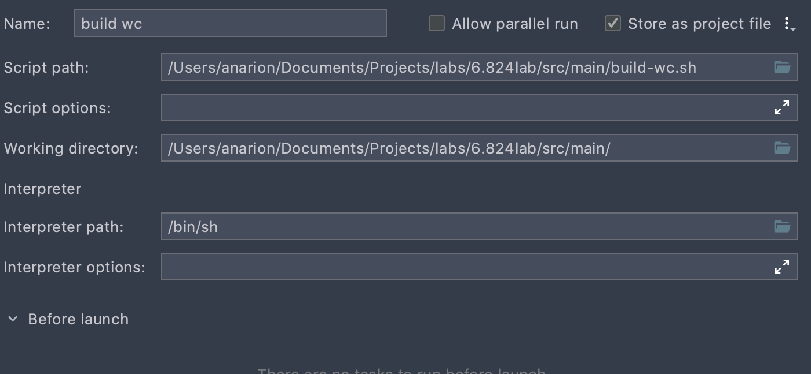
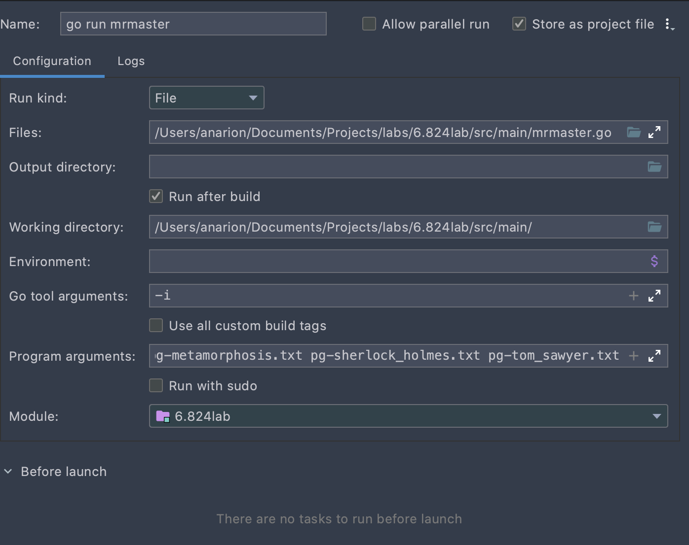

#! https://zhuanlan.zhihu.com/p/260752052
# MIT 6.824 分布式系统 | Lab 1：MapReduce

本文是本人学习`MIT 6.824 Lab 1`的笔记，包含了我自己的实现和理解。本系列其它文章、及本系列详细说明，请看：[MIT 6.824 分布式系统 | 材料准备和环境搭建](https://zhuanlan.zhihu.com/p/260470258)

本文md源码：[AnBlog](https://github.com/Anarion-zuo/AnBlogs/blob/master/6.824/lab1-mapreduce.md)

我写的代码在[我的GitHub仓库](https://github.com/Anarion-zuo/MIT-6.824)，由于完整代码过于冗长，我没有在文章中完全贴出，你可以去这个仓库查看。

`Lab 1`的说明在 [Lab1 Notes](https://pdos.csail.mit.edu/6.824/labs/lab-mr.html)，需要阅读论文[MapReduce](https://pdos.csail.mit.edu/6.824/papers/mapreduce.pdf)。请以这篇说明和论文为主，以本文为辅。在阅读本文之前，务必先通读这篇说明和论文。后面的`Lab`也是一样，直接阅读本文，就是直接看答案了，少很多乐趣和收获。若实在无法阅读英文，再姑且直接阅读本文。

`6.824`所有`Lab`都使用`Golang`为主要编程语言，若你不熟悉，可以快速看看[Golang官方入门](http://tour.golang.org/)。我只花了半小时左右学习`Go`语言，就写出了这个`Lab`，证明要让代码`work`，不是特别困难。当然，要让代码优雅高效，充分学习`Go`语言还是非常有必要的。

本文代码中各种定义和调用非常复杂，很难三言两语说清楚。如果都要一行一行解释，这篇文章篇幅就太太太长了。在本文中呈现代码时，代码中肯定有未解释过的部分，甚至可能占到代码的主要篇幅。请你不要担心，也不要太早地*刨根问底*，文章中呈现的代码块都只是起到解释说明作用，更多算**伪代码**，而不是真正运行的代码。要获得整理好、可直接运行的代码，请看[我的GitHub仓库](https://github.com/Anarion-zuo/MIT-6.824)。

本文思维导图如下，可以辅助阅读：



# `MapReduce`框架

在正式看`Lab`材料之前，先简单概括以下`MapReduce`的原理。你应该已经阅读过[MapReduce论文](https://pdos.csail.mit.edu/6.824/papers/mapreduce.pdf)，如果没有，最好先阅读。



这是论文中讲解`MapReduce`的流程图，基本上解释清楚了。

**输入**数据以文件形式进入系统。一些进程运行`map`任务，拆分了原任务，产生了一些**中间体**，这些中间体可能以**键值对**形式存在。一些进程运行了`reduce`任务，利用中间体产生**最终输出**。`master`进程用于分配任务，调整各个`worker`进程。

输入数据能够产生中间体，这说明原任务是**可拆**的，也就才有了写成分布式的可能性。若原问题不是可拆的，`MapReduce`也就无从谈起。

中间体应均匀地分配给各个`reduce`任务，每个`reduce`任务整合这些中间体，令中间体个数减少，直至无法再减少，从中整合出最终结果。

**输入**数据以什么形式进入系统，原任务应如何**拆分**，**中间体**如何保存和传输，`master`和`worker`之间如何通信和调度，**中间体**如何转化为最终输出。这些都是设计的考量，没有一定之规。

# 任务总览和说明

`Lab 1`要求我们实现一个和[MapReduce论文](https://pdos.csail.mit.edu/6.824/papers/mapreduce.pdf)类似的机制，也就是数单词个数`Word Count`。在正式开始写分布式代码之前，我们先理解一下任务和已有的代码。

用于测试的文件在`src/main`目录下，以`pg-*.txt`形式命名。每个`pg-*.txt`文件都是一本电子书，非常长。我们的任务是统计出所有电子书中出现过的单词，以及它们的出现次数。

## 非分布式实现

这个任务非常简单，如果不写成**分布式**的，一个实现在`src/main/mrsequential.go`中。

将所有文章中的单词分出，保存到一个类似数组的结构中。将这些单词排序，从而相同单词在数组中连续地出现在一起。排序完成后，遍历这个数组，由于相同的单词相邻地出现，统计单词个数就很简单了。



尝试运行`mrsequential.go`，看看最终的输出是什么样子的。

```shell
cd src/main
go build -buildmode=plugin ../mrapps/wc.go
go run mrsequential.go wc.so pg*.txt
```

输出文件在`src/main/mr-out-0`，文件中每一行标明了**单词**和**出现次数**。

`go run mrsequential.go`之后的两项是传给`mrsequential`的命令行参数，分别是一个**动态库**和所有电子书。电子书不需要解释。

在进入`Go`程序之后，动态库由代码主动加载进来。在`src/main`目录下命名为`mr*.go`的几个代码文件中，都有`loadPlugin`函数。如果你使用`Goland`作为主要`IDE`，编辑器会提示*重复函数声明*。在这里，我们给`mrsequential`加载的是在`src/mrapps`目录下的`wc.go`编译得到的动态库。

文件`wc.go`以及`mrapps`目录下的其它几个文件，都定义了名为`map, reduce`的函数，这两个函数在`mrsequential.go`中加载并调用。给`mrsequential`绑定不同的`*.so`文件，也就会加载不同的`map, reduce`函数。如此实现某种程度上的**动态绑定**。

`mrsequential`实现的是**非分布式**的`Word Count`，采用的算法就是上面描述的。这个文件的输出将作为之后测试的**标准**，分布式版本应给出和这个输出完全相同的输出。

## 执行代码

我们的代码主要写在`src/mr`目录下的几个文件，这几个文件由`src/main`目录下两个文件`mrmaster.go, mrworker.go`调用。这两个文件的作用是启动进程、加载`map, reduce`动态库，并进入定义在`src/mr`目录下的主流程。

上面展示了执行`mrsequential`的办法。要执行我们自己写的代码，需要执行`mrmaster.go, mrworker.go`。其中，要给`mrmaster.go`输入电子书文件列表`pg-*.txt`，给`mrworker.go`指定动态库`wc.so`。由于`master`不需要动态库，`worker`不需要电子书文件名，两者接受的命令行参数是不一样的。

```shell
go run mrmaster.go pg-*.txt
go run mrworker.go wc.so
```

现在还什么也没写，所以什么也运行不出来。每次这样的运行，都启动了一个新的进程，进程之间不能直接相互访问对方的变量，必须通过一定的**进程间通信**机制才能实现。我们使用的**进程间通信**是`rpc`。

## 我们的任务

测试时，启动一个`master`和多个`worker`，也就是运行一次`mrmaster.go`、运行多次`mrworker.go`。

`master`进程启动一个`rpc`服务器，每个`worker`进程通过`rpc`机制向`Master`要任务。任务可能包括`map`和`reduce`过程，具体如何给`worker`分配取决于`master`。

每个单词和它出现的次数以`key-value`**键值对**形式出现。`map`进程将每个出现的单词机械地分离出来，并给每一次出现标记为1次。很多单词在电子书中重复出现，也就产生了很多相同**键值对**。还没有对键值对进行合并，故此时产生的键值对的**值**都是1。此过程在下图中`mapper`伸出箭头表示。

已经分离出的单词以键值对形式分配给特定`reduce`进程，`reduce`进程个数远小于单词个数，每个`reduce`进程都处理一定量单词。相同的单词应由相同的`reduce`进程处理。处理的方式和上面描述的算法类似，对单词排序，令单词在数组中处在相邻位置，再统计单词个数。最终，每个`reduce`进程都有一个输出，合并这些输出，就是`Word Count`结果。此过程在下图中箭头进入`reducer`、以及后面的合并表示。



图中，相同的单词由相同`reducer`处理。如第一个`reducer`接受单词`A, B`，最后一个`reducer`接受单词`C`。

测试流程要求，输出的文件个数和参数`nReduce`相同，即每个输出文件对应一个`reduce`任务，格式和`mrsequential`的输出格式相同，命名为`mr-out*`。我们的代码应保留这些文件，不做进一步合并，测试脚本将进行这一合并。合并之后的最终完整输出，必须和`mrsequential`的输出完全相同。

查看测试脚本`test-mr.sh`，可以看到合并每个输出`mr-out*`的指令如下，将每个输出文件的每一行按行首单词排序，输出到最终文件`mr-wc-all`中。

```shell
sort mr-out* | grep . > mr-wc-all
```

故每个`reduce`任务不能操作相同的单词，在`map`流程中分离出的相同单词**键值对**应由同一个`reduce`流程处理。

## `Goland`配置

这里稍微讲一下我的`IDE`配置。使用`IDE`配置好处多多，可以不用每次都打命令行，也可以进行断点调试。我对`Golang`和`Goland`都不能说特别熟悉，只是借着以前用`JetBrains`家软件的经验，试着配置，不排除将来更改的可能性。

主要是在配置中封装几个`go run`指令，需要注意一下几点：

- **工作目录**`Working Directory`要设置成`src/main`。
- 要给进程传一定命令行参数，如电子书文件名和动态库等。
- `Program Arguments`中写`*`星号，不会被当作**通配符**处理，故需要手动输入所有电子书文件名。

我的配置文件在[我的GitHub仓库](https://github.com/Anarion-zuo/MIT-6.824)中`.run`目录下，这也是`Goland`保存配置文件的目录。你应该选择`mrmaster, mrworker`对应的配置文件，放置到你的`.run`目录下。

我的配置如下：





## 注意的点

-   可能要对一些数据结构加锁`Mutex`
-   成功的实现应至少通过脚本`test-mr.sh`测试

# 一些更新

在这里更新一些我的修正和评论区提的问题，尽量解决一些疑惑。请先看完后面的正文实现，如果你还没有看的话。如果你也有疑问，请在评论区指出，说不定是我写错了，我也想继续学习！感谢在评论区讨论的同学们！

【2020.10.12 @[掌中萌虎](https://www.zhihu.com/people/3epochs)的评论】

>   实现的这个队列实际上是一个栈吧？

是的，我的所谓**任务队列**是**先进先出**的，但是在这里，顺序没有太大区别。考虑到写C++时候内存管理的经验，可能把所有操作都放到数组末端，效率可以大一些，但也不一定。

如果说这样的设计有什么缺陷，可能是先进队列/栈的任务有饿死`starved`的风险。如果你认为这个风险是不可接受的，可以改为**先进后出**。当然，最好的实现还是**链表**。

>    为什么AskTask要先检查reduce队列呢? 先检查map队列行不行?

这当然是可以的。

考虑到之后可能的拓展/修改，我特别把这两个检查设计成和顺序无关的。`master`分别有两种状态，一种是**在分发map**，一种是在**分发reduce**。同一时刻，两种状态只能处在一种，进而令这里的检查顺序无关。

如果设计成和顺序有关的，代码可以少几行，进而效率高一点点。

>   MakeMaster的时候为什么把任务全部放进 MapTaskRunning了，不应该是Waiting吗?

这是我在代码中犯的错误，相应代码没有贴到文章中，在[我的GitHub仓库](https://github.com/Anarion-zuo/MIT-6.824)已经改成正确的了。奇怪的是，原本错误的代码居然通过了测试，再次提醒各位，**测试通过不代表没有bug**！

>   为啥worker里，每次拿到一个TaskInfo，为什么不go WorkerMap()呢? 直接WorkerMap(), 那岂不是整个过程都只有一个worker线程在跑吗?

不管是测试脚本，还是我们自己跑`go run`，都是在模拟**集群**。真实运行情况下，各个`master, worker`跑在不同的机器上。我们自己跑`go run`或测试脚本，启动的是相互独立的**进程**，而不是在同一进程下启动多个**线程**，从而更好地模拟真实情况。创建更多`worker`不是在`Golang`代码内部实现的，而是外部启动时多次执行`go run`实现的。

更具体一些，可以这样理解。`MapReduce`机制协调了**集群**层面的并发，每台机器内部的再实现各自**机器**层面的并发，**机器**层面是由**线程**等机制实现的，不应该和`MapReduce`机制发生耦合。不知道这样说是否严谨。

 【2020.10.12 @[陈鲁蛇](https://www.zhihu.com/people/chen-kai-qi-84)】

@[陈鲁蛇](https://www.zhihu.com/people/chen-kai-qi-84)提到`Golang`自身的一个语言机制`chan`可以直接用作**队列**，在我一开始写本文的时候还不知道`Golang`的这个特性，在这里指出。`chan`不但实现了**队列**，还实现了一些同步机制，不需要我们再来**加锁/加条件变量**，非常方便。

**下面回到正文。**

# 任务分配机制

从这里开始，我们的**阅读理解**告一段落，正式开始**写**这个`Lab`。我写的代码在[我的GitHub仓库](https://github.com/Anarion-zuo/MIT-6.824)，由于完整代码过于冗长，我没有在文章中完全贴出，你可以去这个仓库查看。

先设计`master`和`worker`进程之间的任务分配机制，也就是`worker`如何向`master`要任务，`master`又如何选择和分配任务。

这样的设计可能见仁见智，不同的设计的效率和稳定性差别很大。我选择最简单的**任务队列**方式，即`master`维护了一些**任务队列**，指明哪些任务**未分配**、哪些**已分配正在运行**、哪些**已完成**。`worker`请求到达时，就给`worker`分配一个**未分配**的任务，并把这个任务标记为**已分配、未完成**。

这里暂时不关注具体如何进行`Word Count`，只是研究`master`和`worker`之间管理和分配任务的机制。把这个机制确定下来，剩下的更多是改`mrsequential`而已。代码中调用的一些函数没有给出实现，但每次调用都给出了解释。后文一定逐步展开讲解这些函数，你的疑惑会被一个个理清。

## 任务类和接口

有两种**任务**，`map, reduce`，故应定义一个**任务类**接口，由两个不同的类实现。

```go
type TaskStatInterface interface {
	GenerateTaskInfo() TaskInfo
	OutOfTime() bool
	GetFileIndex() int
	GetPartIndex() int
	SetNow()
}
```

实现类：

```go
type TaskStat struct {
	beginTime time.Time
	fileName  string
	fileIndex int
	partIndex int
	nReduce   int
	nFiles    int
}

type MapTaskStat struct {
	TaskStat
}

type ReduceTaskStat struct {
	TaskStat
}
```

如果你对`Golang`和我一样不熟悉，在这里提醒你，`Golang`中**继承**和**多态**两种机制必须分开。虚函数，或称**接口**，必须定义在`interface`中，此为**多态**。在`struct`中写另一个`struct`的名称，前者就可以**继承**后者的属性和方法。

`MapTaskStat, ReduceTaskStat`都继承了`TaskStat`类，也就有了后者的所有属性。这些属性的含义在后面解释。 

`MapTaskStat, ReduceTaskStat`都覆写了`TaskStatInterface`的一些方法，也就使用了`TaskStatInterface`的多态。这些方法的含义在后面解释。

我还定义了一个**任务队列**类，是一个由`TaskStatInterface`组成的数组，可以方便地进行进队列`Push`和出队列`Pop`操作。

```go
type TaskStatQueue struct {
	taskArray []TaskStatInterface
	mutex     sync.Mutex
}

func (this *TaskStatQueue) lock() {
	this.mutex.Lock()
}

func (this *TaskStatQueue) unlock() {
	this.mutex.Unlock()
}

func (this *TaskStatQueue) Size() int {
	return len(this.taskArray)
}

func (this *TaskStatQueue) Pop() TaskStatInterface {
	this.lock()
	arrayLength := len(this.taskArray)
	if arrayLength == 0 {
		this.unlock()
		return nil
	}
	ret := this.taskArray[arrayLength-1]
	this.taskArray = this.taskArray[:arrayLength-1]
	this.unlock()
	return ret
}

func (this *TaskStatQueue) Push(taskStat TaskStatInterface) {
	this.lock()
	if taskStat == nil {
		this.unlock()
		return
	}
	this.taskArray = append(this.taskArray, taskStat)
	this.unlock()
}
```

一个效率更好的**队列**应由**链表**实现，这里利用了`Golang`的切片机制和内存管理特性，直接使用一个类似数组的连续空间实现队列，效率差不多。队列的`push, pop`都在数组末端进行。

## 申请任务

`worker`向`master`通过`rpc`机制申请一个任务。约定这个`rpc`只有返回值，命名为`AskTask`，在`worker`中这样调用：

```go
func CallAskTask() *TaskInfo {
	args := ExampleArgs{}
	reply := TaskInfo{}
	call("Master.AskTask", &args, &reply)
	return &reply
}
```

这基本上是从`CallExample`方法复制的。完成之后，`master`返回给`worker`的信息放在变量`reply`中。

在`master`中应有一个名为`AskTask`的方法，处理来自`worker`的请求。这个方法检查是否有未完成的`map`或`reduce`任务。

```go
func (this *Master) AskTask(args *ExampleArgs, reply *TaskInfo) error {
	// check for reduce tasks
    ...
    // check for map tasks
    ...
    // should exit?
    ...
}
```

若有未分配的`map`任务，即`map`**任务队列**长度非0，则给`worker`分配这个任务，并标记这个任务为**已分配、未完成**。

```go
// check for map tasks
mapTask := this.mapTaskWaiting.Pop()
if mapTask != nil {
    // an available map task
    // record task begin time
    mapTask.SetNow()
    // note task is running
    this.mapTaskRunning.Push(mapTask)
    // setup a reply
    *reply = mapTask.GenerateTaskInfo()
    fmt.Printf("Distributing map task on %vth file %v\n", reply.FileIndex, reply.FileName)
    return nil
}
```

若有未分配的`reduce`任务也是同理。

```go
reduceTask := this.reduceTaskWaiting.Pop()
if reduceTask != nil {
    // an available reduce task
    // record task begin time
    reduceTask.SetNow()
    // note task is running
    this.reduceTaskRunning.Push(reduceTask)
    // setup a reply
    *reply = reduceTask.GenerateTaskInfo()
    fmt.Printf("Distributing reduce task on part %v %vth file %v\n", reply.PartIndex, reply.FileIndex, reply.FileName)
    return nil
}
```

若所有任务都已分配，还要查看是否都运行完成。若所有分配出去的任务未完全运行完成，说明未来可能还有新的任务产生，`worker`应等待片刻后再进行请求。

```go
// all tasks distributed
if this.mapTaskRunning.Size() > 0 || this.reduceTaskRunning.Size() > 0 {
    // must wait for new tasks
    reply.State = TaskWait
    return nil
}
```

若所有分配的任务都已经完成，且没有为分配的任务，则认为整个流程均已经完成，`master`将退出，也令`worker`退出。

```go
    // all tasks complete
    reply.State = TaskEnd
    this.isDone = true
    return nil
```

以上所有代码块合并在一起，就是完整的`AskTask`方法。

`worker`应不断尝试向`master`索取新任务，对`master`返回的信息进行相应处理。

```go
func Worker(mapf func(string, string) []KeyValue,
	reducef func(string, []string) string) {

	for {
		taskInfo := CallAskTask()
		switch taskInfo.State {
		case TaskMap:
			workerMap(mapf, taskInfo)
			break
		case TaskReduce:
			workerReduce(reducef, taskInfo)
			break
		case TaskWait:
			// wait for 5 seconds to requeset again
			time.Sleep(time.Duration(time.Second * 5))
			break
		case TaskEnd:
			fmt.Println("Master all tasks complete. Nothing to do...")
			// exit worker process
			return
		default:
			panic("Invalid Task state received by worker")
		}
	}

}
```

## 任务完成

`worker`每完成一个任务，都向`master`汇报，让`master`进行对应处理。同样使用`rpc`机制实现这个通信，主要由`worker`向`master`传递信息。`worker`中调用`rpc`的代码和之前相似。

```go
func CallTaskDone(taskInfo *TaskInfo) {
	reply := ExampleReply{}
	call("Master.TaskDone", taskInfo, &reply)
}
```

`master`应将任务从`running queue`中取出删除。

```go
func (this *Master) TaskDone(args *TaskInfo, reply *ExampleReply) error {
	switch args.State {
	case TaskMap:
		fmt.Printf("Map task on %vth file %v complete\n", args.FileIndex, args.FileName)
		this.mapTaskRunning.RemoveTask(args.FileIndex, args.PartIndex)
		break
	case TaskReduce:
		fmt.Printf("Reduce task on %vth part complete\n", args.PartIndex)
		this.reduceTaskRunning.RemoveTask(args.FileIndex, args.PartIndex)
		break
	default:
		panic("Task Done error")
	}
	return nil
}
```

需要特殊处理的是，当所有`map`任务都完成，`master`应启动`reduce`任务。实现方式是，在`master`初始化时，只初始化`map`任务，不处理`reduce`任务。检查到`map`任务都完成时，在`reduce`任务队列上添加对应新任务。

则`TaskDone`方法应改为：

```go
func (this *Master) TaskDone(args *TaskInfo, reply *ExampleReply) error {
	switch args.State {
	case TaskMap:
		fmt.Printf("Map task on %vth file %v complete\n", args.FileIndex, args.FileName)
		this.mapTaskRunning.RemoveTask(args.FileIndex, args.PartIndex)
		if this.mapTaskRunning.Size() == 0 && this.mapTaskWaiting.Size() == 0 {
			// all map tasks done
			// can distribute reduce tasks
			this.distributeReduce()
		}
		break
	case TaskReduce:
		fmt.Printf("Reduce task on %vth part complete\n", args.PartIndex)
		this.reduceTaskRunning.RemoveTask(args.FileIndex, args.PartIndex)
		break
	default:
		panic("Task Done error")
	}
	return nil
}
```

# 交换信息

`master`和`worker`之间通过`rpc`机制交换信息。`master`告诉`worker`应该执行哪个任务，`woker`告诉`master`自己完成了哪个任务。

我设计每次`rpc`调用交换的信息保存在如下结构体：

```go
const (
   TaskMap    = 0
   TaskReduce = 1
   TaskWait   = 2
   TaskEnd    = 3
)

type TaskInfo struct {
   // Declared in consts above
   State int

   FileName  string
   FileIndex int
   PartIndex int

   NReduce int
   NFiles  int
}
```

这个结构体包含了和一次任务有关的所有信息。在一些场景下，部分信息时没有必要的，我们还是将信息装载进结构体，以求可靠和将来可能的项目拓展。

由于`Golang`没有**枚举**类型，我使用一系列常量`const`表示任务类型。

`master`在`AskTask`方法中构造`TaskInfo`对象，从而发送给`worker`。在接口`TaskStatInterface`中，我定义了函数`GenerateTaskInfo`，让从`MapTaskStat`或`ReduceTaskStat`向`TaskInfo`的转化非常方便。

```go
func (this *MapTaskStat) GenerateTaskInfo() TaskInfo {
   return TaskInfo{
      State:     TaskMap,
      FileName:  this.fileName,
      FileIndex: this.fileIndex,
      PartIndex: this.partIndex,
      NReduce:   this.nReduce,
      NFiles:    this.nFiles,
   }
}

func (this *ReduceTaskStat) GenerateTaskInfo() TaskInfo {
	return TaskInfo{
		State:     TaskReduce,
		FileName:  this.fileName,
		FileIndex: this.fileIndex,
		PartIndex: this.partIndex,
		NReduce:   this.nReduce,
		NFiles:    this.nFiles,
	}
}
```

在`AskTask`中，直接对参数赋值。

```go
*reply = reduceTask.GenerateTaskInfo()
```

具体`TaskInfo`中携带的信息有什么含义，应如何使用，各种任务又应如何调用，我们接着来看。

# 定义任务和信息交换含义

这里解释`TaskInfo`包含的各个属性在`worker`中的理解，也就是我对`map, reduce`任务的定义。这样的定义取决于个人偏好设置，有很多选择，你也可能使用和我不同的设计。上面代码块中`GenerateTaskInfo`方法实现了我的定义。

## 定义Map任务

一个`map`任务是把**一个**文件拆分为多个`key-value`键值对，并将这些键值对分别分配给特定`reduce`任务。由于整个任务需要处理**多个**文件，也就有多个`map`任务存在。

`master`要给`worker`分配一个`map`任务，则需设置`TaskInfo`中的文件序号`FileIndex`、文件名`FileName`、文件个数`NFiles`，并设置`State`为`TaskMap`常量，将本任务标记为一个`map`任务。`worker`根据这些信息，可以找到要处理的文件，正确执行一个`map`任务。`TaskInfo`中的其它属性不需要使用。

其实**文件个数**就是`map`任务个数，**文件序号**就是`map`任务序号。

## 定义Reduce任务

一个`reduce`任务接受`map`任务产生的文件，将这些文件中的信息整合成一个文件作为输出。多个`reduce`任务将产生多个输出文件，是为之前提到的`mr-out*`。

`master`设置`TaskInfo`中的`reduce`任务序号`PartIndex`、`reduce`任务个数`NReduce`，并设置`State`为`TaskReduce`常量，将本任务标记为一个`reduce`任务。其它属性不需要使用。

## 任务完成通知

`worker`完成一个任务之后给`master`发送一个通知，告诉`master`自己完成了哪个任务。这样的通知同样由发送`TaskInfo`实现，结构体中包含的信息应让`master`能够唯一地确定一个任务。

`worker`在运行过程中没有修改`TaskInfo`中的任何信息，原封不动地把这个结构体发回给`master`。

```go
// doing the task
...
// task done
CallTaskDone(taskInfo)
```

在两个进行`map, reduce`的方法`workerMap, workerReduce`的末尾，我都这样调用`CallTaskDone`方法。

`master`根据收到的完成信息，在方法`TaskDone`中，将相应任务标记为**已分配、已完成**，也就是将相应`TaskStatInterface`从相应队列中删除。

队列中删除某对象的方法是，遍历整个队列找到这个对象，然后删除。一个**集合**结构可能比**队列**结构更适合这样的操作，这里为了简单，也就不做这个优化了。

`master`发现所有`map`任务完成之后，再向`reduce`任务队列上加入一些`reduce`任务。在此之前，所有`worker`都只能接受到`map`任务。这样一来，所有`reduce`任务在`map`任务结束之后再进行。

# 任务执行

我们终于来到了研究具体任务实现的部分。和之前一样，这里有很多设计问题，有很多选择，我选择的设计通常是最简单最`straight forward`的，你也可以做别的设计。

## 任务的输入和输出

再重复一下已经说过很多次的流程。每个`map`任务接受一个`txt`文件，产生一系列**键值对**，并将这些**键值对**分配到特定的`reduce`任务。相同的单词应分配到相同的`reduce`任务去。

第`m`个`txt`文件，对应的第`m`个`map`任务，将产生`nReduce`个文件，其中`nReduce`给定的为`reduce`任务个数。第`m`个`map`任务分配给第`n`个`reduce`任务的所有**键值对**放在单独的文件中，命名为`mr-m-n`。第`n`个`reduce`任务，读取所有命名为`mr-*-n`的文件，获得所有的`map`任务产生给第`n`个`reduce`任务的键值对，将它们合并，生成最终输出`mr-out-n`。

测试脚本将所有命名为`mr-out-*`的文件再整合，可看作一次更进一步的`reduce`任务。

方法`workerReduce, workerMap`实现了以上想法。

## 执行Map任务

主要代码在方法`workerMap`，大部分可以从`mrsequential.go`复制。和`mrsequential.go`不同的是，`workerMap`需要对输出的键值对用`JSON`编码，并恰当地分配这些键值对。

先从电子书文件中读取所有内容，运行`map`函数，和`mrsequential.go`一样。

```go
// read in target files as a key-value array
intermediate := []KeyValue{}
file, err := os.Open(taskInfo.FileName)
if err != nil {
   log.Fatalf("cannot open %v", taskInfo.FileName)
}
content, err := ioutil.ReadAll(file)
if err != nil {
   log.Fatalf("cannot read %v", taskInfo.FileName)
}
file.Close()
kva := mapf(taskInfo.FileName, string(content))
intermediate = append(intermediate, kva...)
```

再创建输出文件和对应的`JSON`编码器。

```go
// prepare output files and encoders
nReduce := taskInfo.NReduce
outFiles := make([]*os.File, nReduce)
fileEncs := make([]*json.Encoder, nReduce)
for outindex := 0; outindex < nReduce; outindex++ {
   //outname := outprefix + strconv.Itoa(outindex)
   //outFiles[outindex], _ = os.Create(outname)
   outFiles[outindex], _ = ioutil.TempFile("mr-tmp", "mr-tmp-*")
   fileEncs[outindex] = json.NewEncoder(outFiles[outindex])
}
```

我们要把`intermediate`数组中的`KeyValue`对象分别写入这些输出文件中。采用的方法是，对`key`求哈希，并对`nReduce`求余。

```go
outindex := ihash(kv.Key) % nReduce
```

使用编码器把这些`KeyValue`写进相应文件。

```go
// distribute keys among mr-fileindex-*
for _, kv := range intermediate {
   outindex := ihash(kv.Key) % nReduce
   file = outFiles[outindex]
   enc := fileEncs[outindex]
   err := enc.Encode(&kv)
   if err != nil {
      fmt.Printf("File %v Key %v Value %v Error: %v\n", taskInfo.FileName, kv.Key, kv.Value, err)
      panic("Json encode failed")
   }
}
```

最终关闭所有文件，并通知`master`自己完成了。

```go
// save as files
for outindex, file := range outFiles {
   outname := outprefix + strconv.Itoa(outindex)
   oldpath := filepath.Join(file.Name())
   //fmt.Printf("temp file oldpath %v\n", oldpath)
   os.Rename(oldpath, outname)
   file.Close()
}
// acknowledge master
CallTaskDone(taskInfo)
```

最终产生的输出文件应都具有命名形式`mr-m-n`。有8个电子书、指定`nReduce=10`，则取值范围$m\in[0,7],n\in[0,9]$，一共产生80个中间文件。

## 使用临时文件

上面创建文件时，没有使用`os.Create`或`os.Open`，而是使用了`ioutil.TempFile`。这是为了处理错误情况。

若在`mapf`或之后要使用的`reducef`中，进程由于某些原因退出了，这样产生的文件就是不完整的。但`reduce`任务分不清哪些是成功的`map`任务输出，哪些不是。所以，我们一开始不使用`mr-m-n`形式的文件名，而是创建一个命名不确定的**临时文件**。

```go
outFiles[outindex], _ = ioutil.TempFile("mr-tmp", "mr-tmp-*")
```

当所有任务成功完成之后，再把这个文件重命名为正确的`mr-m-n`。

```go
oldpath := filepath.Join(file.Name())
os.Rename(oldpath, outname)
```

这样一来，如果`map` 任务不成功，就不会产生一个`mr-m-n`命名形式的文件，而其它成功的任务产生的文件还可以正常进行`reduce`任务。

## 执行Reduce任务

主要代码在方法`workerReduce`，大部分可以从`mrsequential.go`复制。和`mrsequential.go`不同的是，`workerReduce`需要对输入的文件进行`JSON`解码，再进行排序和计数。

从所有`mr-*-n`文件中读取键值对。

```go
innameprefix := "mr-tmp/mr-"
innamesuffix := "-" + strconv.Itoa(taskInfo.PartIndex)
// read in all files as a kv array
intermediate := []KeyValue{}
for index := 0; index < taskInfo.NFiles; index++ {
   inname := innameprefix + strconv.Itoa(index) + innamesuffix
   file, err := os.Open(inname)
   if err != nil {
      fmt.Printf("Open intermediate file %v failed: %v\n", inname, err)
      panic("Open file error")
   }
   dec := json.NewDecoder(file)
   for {
      var kv KeyValue
      if err := dec.Decode(&kv); err != nil {
         break
      }
      intermediate = append(intermediate, kv)
   }
   file.Close()
}
```

将所有键值对按**键**排序。

```go
sort.Sort(ByKey(intermediate))
```

同样适用**临时文件**机制，创建输出文件。

```go
ofile, err := ioutil.TempFile("mr-tmp", "mr-*")
if err != nil {
   fmt.Printf("Create output file %v failed: %v\n", outname, err)
   panic("Create file error")
}
```

像`mrsequential`一样执行`reduce`任务，并写入文件。

```go
i := 0
for i < len(intermediate) {
   j := i + 1
   for j < len(intermediate) && intermediate[j].Key == intermediate[i].Key {
      j++
   }
   values := []string{}
   for k := i; k < j; k++ {
      values = append(values, intermediate[k].Value)
   }
   output := reducef(intermediate[i].Key, values)

   // this is the correct format for each line of Reduce output.
   fmt.Fprintf(ofile, "%v %v\n", intermediate[i].Key, output)

   i = j
}
```

重命名并关闭文件。

```go
os.Rename(filepath.Join(ofile.Name()), outname)
ofile.Close()
```

最终产生一系列`mr-out-*`命名形式的文件。由于指定`nReduce=10`，故最终产生10个`mr-out-*`。

# 测试

写好代码之后，运行测试脚本`test-mr.sh`，应通过所有测试。

测试脚本可能输出过多，不便阅读，可以将输出重定向到一个文件。

```shell
./test-mr.sh > test-mr.out
```

如果正确理解了任务，采用了正确的设计，应该能通过第一个测试`wc test`。如果你使用了上面介绍过的**临时文件**机制，应该能通过第三个测试`crash test`。如果你适当给一些数据结构加锁，应该能通过第二个测试`parallelism test`。

我采用的加锁策略是，对队列`TaskStatQueue`的每个方法都加锁，通过了测试。这可能不是最好的策略，无论是从**正确性**上说，还是从**效率**上说。你可以尝试你认为更好的策略，我采用的策略通过了测试，大体上没有问题。以后有兴致，再来研究一下这个**并发设计**。