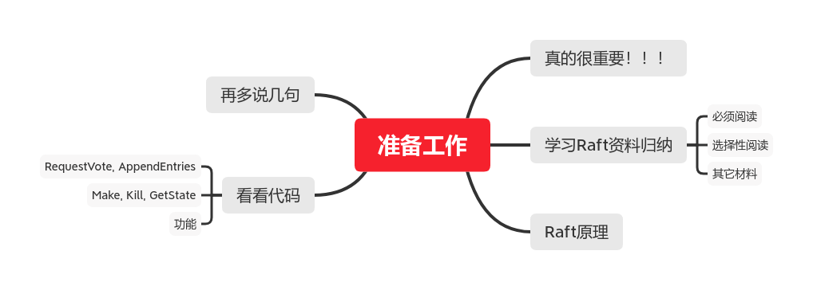
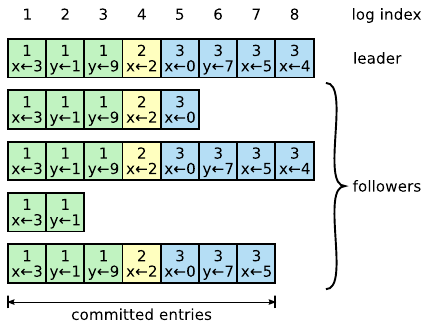
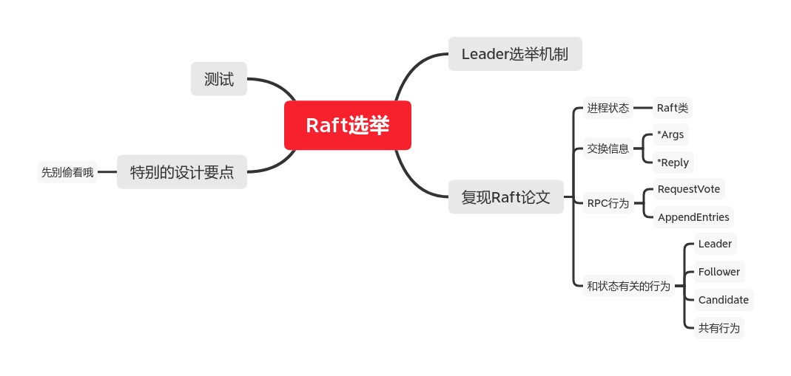
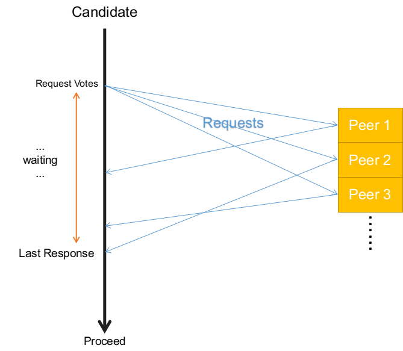
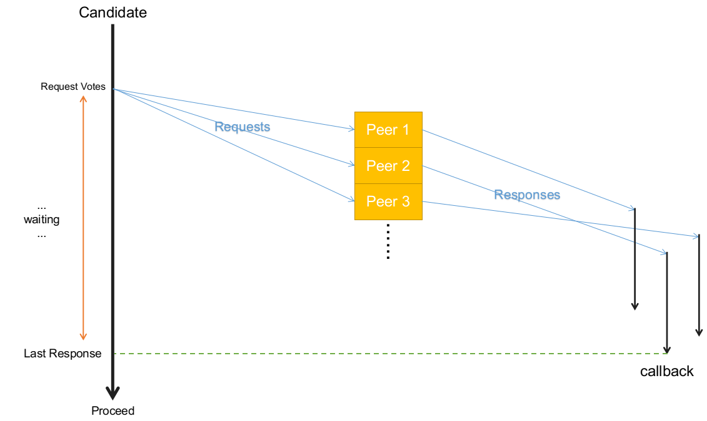
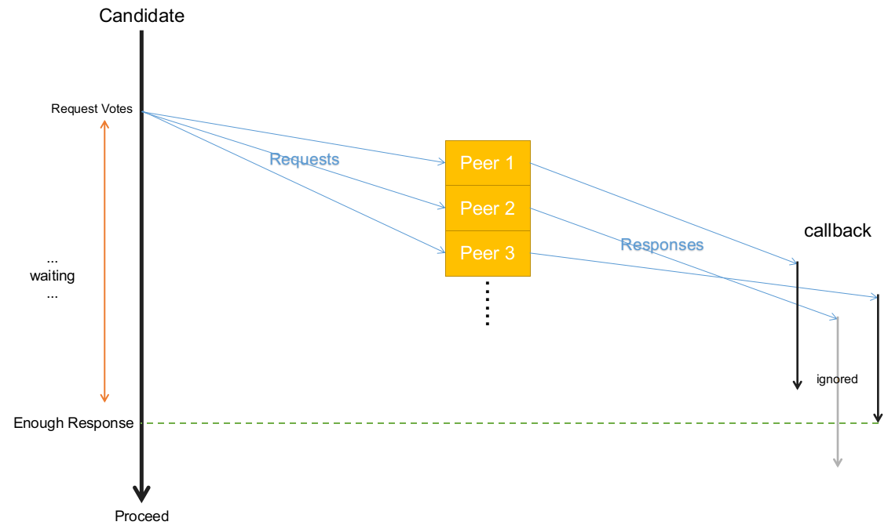

#! https://zhuanlan.zhihu.com/p/264448558
# MIT 6.824 分布式系统 | Lab 2A：Raft选举

本文是本人学习`MIT 6.824 Lab 2A`的笔记，包含了我自己的实现和理解。本系列其它文章、及本系列详细说明，请看：[MIT 6.824 分布式系统 | 材料准备和环境搭建](https://zhuanlan.zhihu.com/p/260470258)

本文md源码：[AnBlog](https://github.com/Anarion-zuo/AnBlogs/blob/master/6.824/lab2a-raft-elect.md)

`Lab 2A`实现著名的`Raft`算法。在对应论文中，作者们不断强调，`Raft`算法相较于`Paxos`等其它共识算法`Consensus`的优势在于**可解释性**`Understandable`，方便教学。即便如此，这个实现对我来说算是非常复杂了。我花了一天多，从早到晚不停研究，才终于让代码通过了`Lab 2A`的测试。

`Debug`多线程非常困难，多线程和系统调度自带的**随机性**，让代码有时能通过测试，有时不可以。每次不通过的原因还可能不同，又令我们雪上加霜。当然，正确的代码应该在任何情况下都能够通过。我跑二十多次`Lab 2A`测试，全部幸运地通过了，即便如此，我依然不能保证代码的**正确性**，更不必说**效率**或**优雅**了。我能保证，我的代码**大致**正确。如果你发现了我的错误，请务必提醒我！

我将配合代码、文字、和简单的示意图讲解，整个算法非常复杂，我不能把所有代码全搬到文章里面。文章中呈现的代码应看做**伪代码**，而不是可以直接运行的代码。其中很多部分不会详细展开讲解，一方面是没有必要、避免啰嗦，另一方面要尽量缩减篇幅，你不必过于*刨根问底*。

完整的、可以直接拿来抄的代码，请看[我的GitHub仓库](https://github.com/Anarion-zuo/MIT-6.828)。当然，真的直接抄就没意思了，不自己操作一遍，你的损失特别大！我不想成为剥夺你学习机会的带恶人。

为了给你提供尽量多的帮助，同时保持你的学习机会，我将给你提供充分的**准备工作指引**，为你增加效率。同时，我尽量减少**剧透**，有些思考和尝试你最好亲自执行，在讲解这些部分之前，我用`Darth Vader`的注视提醒你，防止你直接划到答案上、丢掉了宝贵的学习机会。


当然，如果你执意要看答案，不想自己思考，你也可以直接看，虽然少了很多乐趣。

本文篇幅较长，可以配合穿插的各个思维导图辅助理解。

# 准备工作

在开始写代码之前，请务必做好充分准备。这些准备工作很多，请你尽量做充分，准备中的工作量能顶好几倍之后的代码工作量，减少bug出现概率。做`Lab 2A`的准备工作尤为重要，`Lab 2`的其它部分也依赖这部分的知识，我们需要一个好的开始。

准备工作主要包括两部分，先理解`Raft`算法，再看看给好代码的结构。



## 学习`Raft`

讲义中给了很多参考资料，`Raft`算法本身非常复杂，需要花较多精力理解。推荐你按如下顺序阅读这些材料：

1.  [官网简单介绍](https://raft.github.io/)，只需要看到`Raft Visualization`标题之前。
2.  [一个很棒的可视化](http://thesecretlivesofdata.com/raft/)，慢慢把所有动画放完。
3.  [Raft论文](https://pdos.csail.mit.edu/6.824/papers/raft-extended.pdf)，主要看`Figure 2`和`Section 5`。
4.  [6.824助教写的注意事项](https://thesquareplanet.com/blog/students-guide-to-raft/)

还有一些材料可以选择性阅读：

-   [6.824课程视频](https://www.bilibili.com/video/BV1R7411t71W?p=6)
-   [Raft作者博士论文](https://raw.githubusercontent.com/ongardie/dissertation/master/book.pdf)

如果你需要中文材料，可以参考知乎上的这些文章：

-   本文
-   https://www.zhihu.com/question/29597104

-   https://zhuanlan.zhihu.com/p/110168818

请你花长时间，仔细研究以上材料，确保你能独立地在脑海中放出像[一个很棒的可视化](http://thesecretlivesofdata.com/raft/)那样的动画，充分理解`Raft`算法。讲解`Raft`算法不是本文的主要内容，如果以后有兴致，再写一篇文章，下次一定！

## 几句话说说`Raft`原理

还是简单说一些。

`Raft`的目的是在**多个机器**上维持**相同状态**。客户端对`Raft`集群发送**改变状态**的请求，`Raft`算法保证，集群中所有机器的状态保持一致。

`Raft`通过维持一个**操作记录**结构抱保证一致性。通过机器之前交换信息，在所有机器中维护了一个`log`结构。这个结构按顺序记录了客户端向集群发送的所有操作请求，保证这个结构在所有机器上保持一致，就可以保持所有机器进行一致操作，进而保证广泛的**一致性**。

`Raft`算法选中集群中的一个机器作为**领导**`leader`，起到整体调控的作用。这样的**中心化**设计在分布式领域非常常见，让整个开发工作轻松了很多。



这是[Raft论文](https://pdos.csail.mit.edu/6.824/papers/raft-extended.pdf)中的图，基本解释清楚了。`leader`引导整个流程，将自己的`log`同步到所有`follower`上。有的`follower`没有特别跟上，如第三个。也有完全跟上的，如第二个。方框的颜色表示执行到什么位置，大部分`follower`的执行和`leader`一致，都在执行`x<-2`。第三个`follower`和`leader`执行不一致，之后等它的`log`和`leader`同步之后，它也会执行相同操作，进而和其它机器一致。

无论是`leader`还是`follower`，都有发生错误离线的可能。令整个系统不受错误影响，也是`Raft`的职责。如果`leader`离线，就要重新产生`leader`，这是本文的主要内容。为了区分不同`leader`对应的不同时间段，`Raft`引入概念`term`，每次`leader`发生更换，都是一个新`term`。

## 看看代码和任务总览

`Lab 2A`主要代码写在文件`src/raft/raft.go`。目录`src/raft`下的其它文件都是为**测试**服务的，测试主要流程在`test_test.go`。

`Lab 2A`的测试流程主要在`test_test.go`的前两个函数`TestInitialElection2A， TestReElection2A`，主要关于`leader`的**产生**和**重新产生**。`Goland`有对`gotest`的完全支持，请看[Goland官方文档](https://www.jetbrains.com/help/go/testing.html)。使用`Goland`可以方便地运行单个测试，并使用**断点调试**。

测试流程通过一些复杂的手段启动和管理各个`Raft`进程，我们最好通过测试流程`test_test.go`调用`raft.go`中的代码，而不是另外写一个`main.go`。主要调用和管理`Raft`进程的代码主要在`config.go`，调用`raft.go`中提供的函数`Make, Kill, Raft.GetState`，分别对应**创建、销毁、查看**`Raft`进程。

我们需要在`raft.go`中实现**选举**和**心跳信号**，具体表现为两个功能：

1.  一系列调用`Make`创建`Raft`进程后，进程之间选举出一个`leader`。
2.  `leader`相对于其它进程离线后，其它进程在它们中间重新选举一个`leader`。

这两个功能分别对应`TestInitialElection2A, TestReElection2A`，前者相对容易实现，后者需要`Raft`之外的一些设计。

## 在开始写代码之前

按惯例，除了论文还要阅读[Lab 2 Notes](https://pdos.csail.mit.edu/6.824/labs/lab-raft.html)，如果你还没阅读的话。前面没有指出来，是因为[Lab 2 Notes](https://pdos.csail.mit.edu/6.824/labs/lab-raft.html)和**学习Raft**这件事情关系不大。现在指出来，是因为[Lab 2 Notes](https://pdos.csail.mit.edu/6.824/labs/lab-raft.html)里面讲了很多代码介绍和要求，需要你特别注意。在这里归纳出几点：

-   `Lab 2A`主要和`leader`选举机制有关。
-   主要编程指引在[Raft论文](https://pdos.csail.mit.edu/6.824/papers/raft-extended.pdf)的`Figure 2`中，必须按照它的逻辑严格执行，最好不自己发挥。
-   使用的`RPC`命名和`Figure 2`中相同，用`RequestVote`**索取选票**，用`AppendEntries`实现**心跳信号**。
-   有一些和**等待**有关的参数需要小心选取。

除此之外，基于我自己写这个`Lab`的经验，再提醒你一下：

-   没有理解清楚算法流程不要硬上，多看看论文，反复琢磨总是能懂的！
-   不要先追求**效率**或**优雅**，很多错误就是这么来的，先追求**正确！**
-   多线程代码不要用**断点调试**了，可以尝试在终端`print`一些信息，像这样：

```
[Peer 1 Leader term 2] sending heartbeat signal to peer 2
[Peer 1 Leader term 2] all heartbeats sent, sleeping for 120 then send heartbeats again
[Peer 0 Follower term 2] got heartbeat message from leader peer 1 at term 2
[Peer 1 Leader term 2] heartbeat response from peer 0 received in 138.851µs success true
[Peer 2 Leader term 1] heartbeat response from peer 0 received in 70.168149ms success true
[Peer 2 Leader term 1] found peer 0 unreachable when sending heartbeats
[Peer 2 Leader term 1] sending heartbeat signal to peer 0
```

-   我的完整实现请看[我的GitHub仓库](https://github.com/Anarion-zuo/MIT-6.828)，**不要照抄！！！**

如果怎样都调不通，可以依次尝试：

1.  调整**等待时间**参数
2.  检查`GetState`方法是否正确
3.  阅读终端输出信息
    1.  检查是否出现**死锁**
    2.  其它就先不剧透啦

说了这么多，你可以开始写代码了。在你写好之前，**请不要继续阅读本文**。后文中的一些结论，我花了很长时间才发现，本来一起列在上面了，后来还是觉得不要**剧透**太多，给你留多一点发挥的空间，才能学到更多，不应该把这个机会就这样抢走。我也不想成为剥夺你学习机会的带恶人。

图片之后正式开始。




# `Leader`选举机制

看到这里，你应该对`Raft`的`leader`选举机制有了自己的理解。如果你不能在脑海里大概地模拟整个过程，强烈建议你回到上文列出的材料中，再仔细体会。如果你觉得自己准备好了，就来看看我的理解。

只看单个进程的选举非常简单。一个在`Candidate`状态下的进程，等待一定时间之后，如果自己还是`Candidate`，就**发起选举**，尝试让自己成为`leader`。进程向所有其它进程**拉票**，也就是发动`RequestVote RPC`。根据其它进程发回的信息，判断是否成功获得选票。所有选票收集得到之后，如果选票个数超过了进程个数，则认为自己成功当选。如果没有成功当选，就维持`candidate`状态，等待一定时间之后再发动选举。

**共识**不是单方面的，进程认为自己当选了，其它进程也要这么想才是。一个**认为**自己是`leader`的进程，开始向其它进程发送**心跳信号**`heartbeat`，也就是发送`AppendEntries RPC`。若其它进程没有**认可**这个心跳信号，进程自觉退回`follower`状态。

注意到，进程**发起选举、发送心跳信号**都是**主动**的，主动尝试成为`leader`，主动验证是否成功。其它进程都是**被动**行动，接收到**拉票**才决定是否给出选票，接收到**心跳信号**才决定是否承认`leader`地位。

对于**发起选举**的进程，成功则成为`leader`，失败则维持`candidate`。对于参与选举的其它进程，选出`leader`则成为`follower`，未选出则维持原状。可以看到，**发起选举**和**参与其它选举**并不矛盾，可以**同时**进行。当其中一边完成之后，另一边马上退出，也能得到正确结果。如果你愿意的话，这段短短的描述就是`leader`选举机制的**正确性证明**。

# 复现`Raft`论文

有了[Raft论文](https://pdos.csail.mit.edu/6.824/papers/raft-extended.pdf)的`Figure 2`，我们可以依样画葫芦，亦步亦趋地按照论文中的要求来实现。简单实现之后，你应该可以让代码通过第一个测试`TestInitialElection2A`。

## 进程状态和交换信息

`Figure 2 State`栏包含了一个`Raft`进程具有的所有信息，我们把它们全部加入`Raft`类中，部分属性还暂时用不到。

```go
myState     int
currentTerm int
votedFor    int

commitIndex int
lastApplied int
nextIndex   int
matchIndex  int
```

两个`RPC`需要交换一些信息，分别列在`Arguments`和`Results`下，我们把它们全部加入到对应`Args`和`Reply`类中。

```go
type RequestVoteArgs struct {
	Term         int
	CandidateId  int
	LastLogIndex int
	LastLogTerm  int
}

type RequestVoteReply struct {
	GrantVote bool
	Term      int
}

type AppendEntriesArgs struct {
	// machine state
	Term     int
	LeaderId int
	// log state
	PrevLogIndex int
	PrevLogTerm  int
	//entries
	LeaderCommit int
}

type AppendEntriesReply struct {
	Term    int
	Success bool
}
```

## 两个`RPC`

`Figure 2`详细描述了两个`RPC`，`AppendEntries, RequestVote`的流程。我们需要定义这两个`RPC`，并按照`Figure 2`的指引正确执行。除了这两个`RPC`之外，还有一些行为，根据进程处在的状态而定，我们后面再讨论。

`RequestVote`有两部分，**忽略旧`term`**和**有条件给选票**。

当进程收到来自`term`比自己小的进程的**拉票**`RequestVote`，进程将自己的`term`值告诉它，并忽略。

```go
if rf.tryDiscardOldTerm(args.CandidateId, args.Term) {
   reply.Term = rf.currentTerm
   reply.GrantVote = false
   return
}
```

当进程收到**拉票**`RequestVote`，自己的`log`满足一定条件，自己的投票状态`votedFor`也满足一定条件，则给出选票。`votedFor`指的是**当前认定的`leader`**。和`log`有关的判断暂时不关心。

```go
if rf.votedFor < 0 || rf.votedFor == args.CandidateId {
   if rf.commitIndex <= args.LastLogIndex {
      reply.GrantVote = true
      rf.timerCleared = true
      return
   }
}
```

当进程接收到**心跳信号**`AppendEntries`，应该：

1.  丢弃过期的`term`
2.  暂时不关心其它和`log`有关的操作

## 几种状态的不同行为

进程可能处在三种状态，具有不同职能， `Follower, Candidate, Leader`。在不同状态下，进程接受/发送`RequestVote, AppendEntries`等`RPC`时的行为不同，我把和`leader`选举有关的列在下面。可以看做`Rule for Servers`的翻译。

处在`Leader`状态下时：

1.  选举成为`Leader`成功，马上向所有其它进程发送**心跳信号**`AppendEntries`。

处在`Follower`状态下时：

1.  响应各种`RPC`。
2.  超过一段时间未接受到**心跳信号**，切换为`candidate`。
3.  接受到心跳信号，重置计时器避免切换为`candidate`。
4.  接受到**拉票**`RequestVote`，重置计时器避免切换为`candidate`。

处在`Candidate`状态下时：

1.  随机等待一定时间，然后**发起选举**尝试成为`leader`。
    1.  增加自身`term`计数，进入一个新`term`。
    2.  为自己增加一票。
    3.  向所有其它进程拉票。
2.  收到**超过半数**的选票，成为`leader`，开始发送**心跳信号**。
3.  收到来自另一个进程的**心跳信号**`AppendEntries`，切换为`follower`。
4.  没有切换为`leader`或`follower`，随机等待一段时间，重新**发起选举**。

无论进程处在什么状态，具有什么职能，有些行为是共同的。我把和`leader`选举有关的列在下面：

1.  接受到的`RPC`请求中、或得到的`RPC`响应中，包含的`term`信息，比自己的`term`值更大，需要切换到`follower`状态。

## 代码实现

完整代码过于冗长，机械地贴在这里只会空占篇幅。这里只抽象讲解我的实现框架，具体完整代码请看[我的GitHub仓库](https://github.com/Anarion-zuo/MIT-6.828)。

在`Make`函数中，我们初始化`Raft`对象，主要是设置等待参数，包括**心跳信号频率**和**等待心跳信号超时上限**。除此之外，还把当前自己认定的`leader`设置为**空**，用特殊值`-1`表达。

```go
rf.votedFor = -1
rf.electWaitDuration = 300
rf.heartBeatWaitDuration = 120
```

当前状态应设置为`follower`：

```go
rf.myState = FollowerState
```

然后启动这个`Raft`进程，主要流程写在`Run`方法中。

```go
go rf.Run()
```

主流程不断循环，根据进程的**当前状态**，执行不同的行为：

```go
func (rf *Raft) Run() {
   for {
      switch rf.myState {
      case LeaderState:
         ...
         break
      case FollowerState:
         ...
         break
      case CandidateState:
         ...
         break
      default:
         panic("Invalid peer state!")
      }
   }
}
```

之后的就是机械执行`Figure 2`。

完成以后，代码应该至少通过测试`TestInitialElection2A`。

# 特别的设计要点

写出**差不多**正确的代码相对简单，机械地按照上面**复现Figure 2**就可以了，**差不多**的代码可以通过`TestInitialElection2A`测试。**差不多**的代码**可能**可以通过`TestReElection2A`测试，如果运气好的话。运气经常是时好时坏的，所以第二个测试可能**有时通过，有时不通过**。完全正确的代码才能**总是通过**，我们当然希望得到**总是通过**的完美结果。

如果你遇到了**有时通过、有时不通过**这样的情况，请你不要继续往下阅读，再多研究一下下，想想还有什么改进的办法。个人认为，这个部分是`Lab 2A`的精华，如果你能独立琢磨出此处玄机，一定收获巨大。如果你已经充分思考、尝试过了，图片之后正式开始。


测试`TestReElection2A`是要看看，我们的`Raft`是否能在规定时间内重新选举一个`leader`。这就要求我们，不但要能够**正确执行**，还要能够**在规定时间内**正确执行。我们不得不进行额外设计，考虑和**时间**有关的参数。

和时间有关的参数大概有3个：

1.  `Follower`等待心跳信号的时间，超过这个时间没有收到新的**心跳信号**或**拉票**，切换为`Candidate`。
2.  `Leader`发送心跳信号之间的间隔时间。
3.  `Candidate`发起选举之前，随机等待时间的**最大/最小**值。

我`Debug`了大半天，观察到一个现象：**先用电脑干别的，再回来运行测试，通过的概率更大**。这把我引向一个猜想：**是否正确运行和操作系统线程/进程调度行为有关**。不管这个猜想是否正确，这个现象让我更加相信，**各种等待时间**非常重要！

基于此信心，建议你先尝试在初始化函数`Make`中，调整各个等待时间参数的值，看看这样能否解决你的问题。这样的参数调整是**治标不治本**的，要真正解决问题，需要调整设计。

我将按自己的经历比较和引出新旧设计，并解释这样做的原因。这更多是我的**心路历程**。或许你已经采用了正确的设计，或许比我下面要说的更加**优雅/高效**，请你一定提醒我，我也想学习！

还是那句话，完整代码请看[我的GitHub仓库](https://github.com/Anarion-zuo/MIT-6.828)。

## 同步异步

我一开始采用了非常原始的设计。进程向其它进程发送`RPC`时，一定要分别等待它们完全回复才继续执行其它流程。这是一种**同步**。



这样的设计可以通过测试`TestInitialElection2A`，因为它可以**正确运行**，但是不可以**在规定时间内**正确运行。若出现一个`Peer`，响应时间很长，或干脆没有响应，`leader`的其它流程就会被拖慢。`leader`本应发送心跳信号，或本应响应一个新的`leader`，可能因为这个**同步等待**而发生拖延，进而拖延整个集群。

解决**同步**的问题当然是采用**异步**机制。进程发送完**心跳信号**`AppendEntries`或**拉票**`RequestVote`之后不等待其它进程的响应，而继续进行其它操作。之后收到响应，再调用一个**回调函数**处理响应。

举个例子，**拉票**发送请求如下：

```go
for peerIndex, _ := range rf.peers {
    if peerIndex == rf.me {
        // does not send to myself
        continue
    }
    if rf.myState != CandidateState {
        return
    }
    fmt.Println(rf.PrefixPrint(), "requesting vote from peer", peerIndex)
    rf.sendRequestVoteAsync(peerIndex, args, &replyArray[peerIndex], requestInfo)
}
```

方法`sendRequestVoteAsync`就是**发送异步请求**，收到请求之后调用**回调函数**`requestVoteCallBack`。

```go
go func() {
   if info.MustExit {
      return
   }
   sendBegin := time.Now()
   ok := rf.sendRequestVote(peerIndex, args, reply)
   sendEnd := time.Now()
   fmt.Println(rf.PrefixPrint(), "vote response from peer", peerIndex, "received in", sendEnd.Sub(sendBegin))
   rf.requestVoteCallBack(ok, peerIndex, args, reply, info)
}()
```



这样的修改让测试`TestReElection2A`通过的概率变大了。

以上设计还有问题。

以上异步设计解决了：**因一个Peer超时响应而没有及时给其它Peer发送同类请求**。没有解决：**因一个Peer超时响应某一类而没有及时给其它Peer发送其它类请求**。

如某进程**发起选举**，一定要等到所有进程都进行投票之后，才继续执行**发送心跳信号**等其它动作。其它进程不会因**没有及时收到RequestVote**而发生拖延，但可能因为**没有及时收到AppendEntries**而发生拖延。最终，整个集群固然可以正确运行，但是效率受到极大影响。

我们接着改进。

## 提前决策

以**发起选举**为例。其实，进程不需要等到所有其它进程都发回**投票**再决定自己是否当选`leader`。当收到的`Grant Vote`数量超过集群中总的进程数量，就可以认为自己成功当选了！我们称之为**提前决策**。

当出现一些`Peer`很久都没有响应，只要数量不多，对`leader`选举的影响就不大。

当进程发现自己已经可以成为`leader`时，就不再向其它进程发送新的**拉票**`RequestVote`，也不再等待其它进程的**响应**，可以直接继续进行。

```go
if requestVoteInfo.SuccessCount+1 > requestVoteInfo.TotalCount/2 {
   // leader claimed!
   fmt.Println(rf.PrefixPrint(), "got", requestVoteInfo.SuccessCount, "votes in", requestVoteInfo.AliveCount, "alive peers", requestVoteInfo.TotalCount, "total peers")
   rf.myState = LeaderState
   rf.votedFor = rf.me
   fmt.Println(rf.PrefixPrint(), "elected leader at term", rf.currentTerm)
   requestVoteInfo.SetMustExit()
}
```



我花了很长时间才完善到这里，现在已经能通过测试`TestReElection2A`。有很多代码细节，就不在这里详细一一细展示了，你的具体实现可能和我很不一样。

## 更激进的`Pipeline`策略

本来已经完事了，写文章的时候又有了一个奇思妙想，在这里描述一下。可能可以更进一步加强效率，但难度较大，也不是那么有必要了。

还是拿**发起选举**举例子。进程在发动选举之后，不进行任何形式的等待，将自己的当前状态复制几份，分别以`Leader, Follower, Candidate`的状态同时运行。当选举完成之后，判断最终应处在哪个状态，保留那个状态，并丢弃其它状态。

可以想象，这个设计的实现是非常复杂了。我应该是没有兴致再来尝试了，如果你觉得这个猜想可行，就来试试吧。

## 简易定时器

比起前面讲到的，这里要说的相对没那么重要。我研究了一下`Golang`的原生定时器机制`Timer, Ticker`，看到很多评论说它们很*坑*。我没有信心完全掌握它们，不想在本来就`bug`百出的代码里再增加`bug`来源，也就没有使用它们。

这里介绍以下我自己设计的**定时器机制**，非常简单，非常**不坑**。当然，你也可以使用`Golang`的原生机制。

把**一次等待**拆分成好几等分，是不是检查定时器是否被要求**重置**。若定时器被要求重置，则重新开始等待。

```go
checkCount := 200
divDuration := rf.electWaitDuration / checkCount
for {
   for checkIndex := 0; checkIndex < checkCount; checkIndex++ {
      if rf.timerCleared {
         // restart timer
         break
      }
      if rf.votedFor == -1 {
         fmt.Println(rf.PrefixPrint(), "has no leader, converting to a candidate")
         rf.myState = CandidateState
         return
      }
      time.Sleep(time.Millisecond * time.Duration(divDuration))
      if rf.myState != FollowerState {
         return
      }
   }
    rf.timerCleared = false
}
```

若等待完成，则说明没有收到**心跳信号**，需要切换为`candidate`。

```go
if !rf.timerCleared {
   // not brought here by a timeout event
   // timer manually reset
   fmt.Println(rf.PrefixPrint(), "did not receive heartbeat signal from supposed leader peer", rf.votedFor, "in", rf.electWaitDuration, "ms, converting to a candidate")
   // no leader now
   rf.votedFor = -1
   rf.myState = CandidateState
   return
}
```

外部流程**重置定时器**的方法是设置`timerCleared`属性。

```go
rf.timerCleared = true
```

这个设计很简单，在这里只是稍微提一提，以免你可能因此对我的代码产生疑惑。

# 测试

第一个测试`TestInitialElection2A`相对确定，通过就没问题，不通过就是有错误。重点是`TestReElection2A`，即便代码不完美，也有可能通过。你不能满足于**有时通过**，应该跑很多次，保证是**总是通过**。

希望你玩的开心。