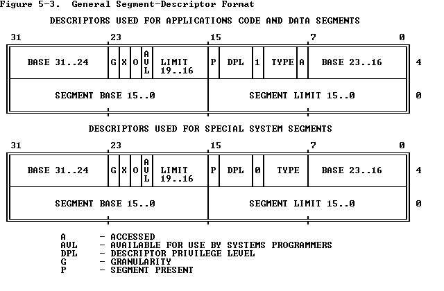
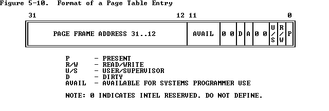

# MIT 6.828：实现操作系统 | Lab 2 Part 2：内核内存映射

本文是本人实现`6.828 Lab 2 Part 2`的笔记，接续上一篇：

https://zhuanlan.zhihu.com/p/176967610

如果你还没有阅读上一篇，请务必阅读后再阅读本文。其他Lab笔记在专栏不定期更新，环境搭建请看：

https://zhuanlan.zhihu.com/p/166413604

本文md文档源码链接：[AnBlogs](https://github.com/Anarion-zuo/AnBlogs/blob/master/6.828/lab2-part2.md)

上一篇`Part 1`实现了分配器，用的是非常简单的链表管理方式。分配器实现的是**剩余空间管理**`Free Space Management`，有了剩余空间管理，接下来就是实际使用这些空间了。

这个`part`帮助我们正式建立**虚拟内存**`Virtual Memory`和**物理内存**`Physical Memory`之间的关系，明确了概念，完成了实现。在很多操作系统教材中，内存映射放在`Free Space Management`之前讲。在真正实现内存管理的时候，必须先有分配器、后有其它的，和讲解知识相反。

和之前的Lab一样，我强烈建议你先自己研究Lab的材料，再看我的实现过程，提升能力才是我们做Lab的目的。本文对应的Lab讲义：https://pdos.csail.mit.edu/6.828/2018/labs/lab2/

本文目录：


# `x86`内存管理机制

弄清楚`x86`的内存管理机制，是本文的核心，也是这个Lab的核心。可以说，弄清楚了`x86`的内存管理机制，就基本上完成了`part 2`。这个标题下，我详细介绍我对这个内存管理机制的理解。同样，我强烈建议你先自己阅读Lab讲义、[Lab搭配的80386 Programmer’s Reference Manual的Chapter 5](https://pdos.csail.mit.edu/6.828/2018/readings/i386/c05.htm)和Lab已经提供的代码，建立自己的理解，再来对照我的理解。

如果你已经自己思考过了，那么请看我的理解吧。

## 两步映射总览

`x86`建立了两次映射，程序给出地址，经过这两次**翻译**之后，才输出从到总线交给内存芯片。这两次映射分别为`Segment Translation`和`Page Translation`，我也不知道中文翻译具体是什么，为了避免错误和歧义，下文都保留英文称呼。

`Segment Translation`将虚拟地址转化为**线性地址**`Linear Address`，`Page Translation`将线性地址转化为物理地址，也就是真正用来索引内存的地址。

在我们的项目中，还没有对`Segment Translation`做特殊处理。Lab讲义中说明了，`Segment Translation`没有映射虚拟地址，线性地址和虚拟地址相同。后文中，我不会使用**线性地址**一词，而统一使用“虚拟地址”同时代指虚拟地址和线性地址，因为它们就是一样的！之后的Lab可能会改变这一点，那就之后再说吧。

我们暂时没有使用复杂的`Segment Translation`，所以`Page Translation`就是我们的重点，以下简单介绍`Segment Translation`，着重理解`Page Translation`。

## Segment Translation

`Segment Translation`的过程可以如下图表示：


由一个事先指定的`selector`选择器，从一个**描述符表**`descriptor table`中读出一个描述符`descriptor`。由这个描述符读出一个**基地址**`base address`，虚拟地址作为一种**偏置**`offset`，加到**基地址**上，就得到了`linear address`。

### 描述符表`Descriptor Table`

描述符表必须事先指定，虚拟地址中不包含关于描述符表的信息。

有两种描述符表，分别为**全局描述符表**`Global Descriptor Table (GDT)`和**本地描述符表**`Local Descriptor Table (LDT)`，分别使用寄存器`GDTR, LDTR`获得。`x86`有访问这些寄存器的指令，我们没有直接使用，也就不关心了。

具体如何加载`segment`描述符表，如何使用，不是本`part`的重点。

### 描述符`Descriptor`

通过`selector`索引描述符表得到的描述符，除了基地址之外，也包含了其他信息，具体结构如下图：



这是两种不同的结构，其中的区别只有`DPL`和`TYPE`之间的那个`bit`，以及`TYPE`的位置，我们暂时不关心它们的区别。这里需要注意的是`P`域，也就是`Segment Present bit`，表示这个`segment`是否在内存中，之后的`Page Translation`也有类似机制。

### 选择符`Selector`

选择符不但有描述符表的索引，还有选择描述符表`GDT/LDT`的`bit`，以及发出的请求所在的优先级，用于区分`User Level Access`和`Kernel Level Access`。我们也暂时不关心它们的区别。结构如下：


### 和`segment`有关的寄存器

虚拟地址只是一个`segment`的偏置，本身不包含和`segment`有关的信息。当前使用的描述符表、描述符选择符，都要另外存储在一些寄存器里面。当使用和跳转有关的指令`call, jmp`时，这些寄存器被隐式地访问了，从而帮助计算新的地址。

`segment`寄存器有两个部分，可以直接操作和读取的是`16bit`的`selector`域，修改`selector`域之后，硬件自动将对应的描述符从描述符表中读取进不显示的`descriptor`域，这样就方便了后续操作。


我们也暂时不关心如何使用这些寄存器。

## Page Translation

这是本文本`part`的重点，需要深刻理解，否则无法理解后续代码实现。最好再阅读一遍`x86`编程手册有关内容：https://pdos.csail.mit.edu/6.828/2018/readings/i386/s05_02.htm

过程如下：


虚拟地址，也就是线性地址，被拆成了三部分，都是一种**索引**`index`，分别索引的是`Page Directory, Page Table, Page Frame`。从`page directory`中读出`page table` 的地址，在从读到的`page table`地址中读到`page frame`的地址，索引`page frame`之后，就得到相应物理地址上的内容。

对于开发者来说，`page directory, page table`都是两个数组，拿到`page directory`的头部指针，和虚拟地址一起，就可以确定物理地址。

### 每个域对应长度

线性地址，也就是虚拟地址，的格式如下：


每个域包含`bit`的个数，也就是**长度**，决定了每个域对应的数组的长度。我们可以很方便地得到每个域对应的长度：

```python
page_len = 2 ** 12 = 4096            // OFFSET
page_table_len = 2 ** 10 = 1024      // PAGE
page_dir_len = 2 ** 10 = 1024        // DIR
```

如果你不太理解这种计算方法，可以回到最开始的排列组合。每个`bit`代表两种状态，有`n`个`bit`也就有$2^n$种状态，也就是这个域可以产生多少索引。

以上计算出了每个域的**长度**，单位不是**字节**，而是**索引个数**。

这些长度应该这样看。一个`page directory`指向1024个`page directory entry`，一个`page directory entry`指向了`1024`个`page table`，一个`page table entry`指向了`1024`个`page frame`，一个`page frame`中包含`4096Bytes`。

### Entry格式

`page directory entry, page table entry`具有相同格式，如下：



`DIR, PAGE`域长度相同，而`entry`的格式也相同，说明`page directory`和`page table`其实是相同结构的嵌套。可以把`page directory`理解为高一级的`page table`，整个内存管理形成两个层级。一个`page table`自身就是一个`page`，是有`page directory`管理的，而`page table`又管理了`page frame`。

同理，我们可以把虚拟地址拆得更细，从而创造更多的层级，不过这是CPU设计的事情了。

对于`page directory`来说，`entry`中`12-31`位上的`PAGE FRAME ADDRESS`就是一个`page table`的基地址。对于`page table`来说，这个地址是一个`page frame`的基地址。通过一个虚拟地址，获得3个索引，一次访问这3个结构，就可以得到物理地址了。

这里还要注意一下，`bit 0`是`Present Bit`，表示当前`entry`中的信息是否可以用于映射。要是`Present Bit`设置为0，则这个`entry`不包含有效信息。索引各种`page directory/table`时，必须先检查这个`bit`。

`entry`中的其他部分暂时不使用。

# 可以使用的工具代码

在开始写代码之前，需要看看项目中已经提供好了哪些可以使用的工具。

首先是上个`part`中写好的分配器，`boot_alloc`已经不使用了，主要是`page_alloc/page_free`在使用。

然后就是三个头文件`mmu.h, memlayout.h, pmap.h`中的各种小函数了，文件中的注释有很详细的说明，建议你把这三个文件的注释好好读一读。基本上是取出`entry`中的每个域的值，而`entry`的格式如上所述。我们完全可以自己完成这些操作，Lab中已经提供好了代码，使用这些代码有助于代码语义化。在这里就不详细介绍了，后面用到的时候会稍微介绍。

和之前一样，建议你先试着自己写代码，再来看我的代码。不看也没问题，只要你写的代码能够通过测试函数`check_page`就OK。如果测试没有通过，`panic`函数直接把内核带回内核初始化函数`i386_init`，系统进入终端，并打印错误信息，你可以根据这个错误信息找出错误。

# 根据虚拟地址取出`Page Table Entry`

这里开始实现Lab讲义中指定要实现的函数，先是`pgdir_walk`函数，在文件`kern/pmap.c`中。这个函数接受一个`page directory`和一个虚拟地址，要求得到虚拟地址在这个`page directory`下对应的`page table entry`。

先拆分虚拟地址，根据虚拟地址取出`page directory/table/frame`中的索引。用到的三个宏函数在文件`mmu.h`中，也就是通过移位`>>`和与`&`从一串`bit`中取出一些`bit`。

```c
uintptr_t pdx = PDX(va);       // page directory index
uintptr_t ptx = PTX(va);       // page table index
uintptr_t pgoff = PGOFF(va);   // page frame index
```

拿到索引就可以取出相应`entry`了。先取出`page table entry`。

```c
pde_t *pde = &kern_pgdir[pdx];
```

注释中要求了先要检查当前`page table`是否存在，不存在就要根据函数参数的要求创建一个。若`create`参数非0， 则是要创建新的`page table`。

```c
if (!*pde & PTE_P) {
    // page table does not exist
    if (create) {
        // allocate new page
        // page directory entry is set up by this function
        struct PageInfo *pageInfo = create_pgtbl(pde);
        if (pageInfo == NULL) {
            // allocation failed
            return NULL;
        }
    } else {
        return NULL;
    }
    // pte info is setup in crea_pgtbl
}
```

代码中使用了宏`PTE_P`，也就是取出了`entry`中的`Present Bit`，判断当前`entry`是否包含有效信息。相应的`PTE_*`形式的宏在`mmu.h`头文件中定义，帮助我们取出`entry`的各种`bit`。

代码中调用的`create_pgtbl`为另外写的函数，传入`page directory entry`，可以在这个函数内部创建好`page table`之后马上更新`page directory`。

```c
static struct PageInfo *create_pgtbl(pde_t *pde) {
    struct PageInfo *pageInfo;
    // must create new
    pageInfo = page_alloc(ALLOC_ZERO);
    if (pageInfo == NULL) {
        // allocation failed
        return NULL;
    }
    // must increment reference according to notes
    pageInfo->pp_ref += 1;
    // update page directory
    // set upper address field
    // here it must be physical address, not virtual address
    *pde = page2pa(pageInfo);
    /*
     * Notes:
     * The page frame address specifies the physical starting address of a page.
     */
    // set present bit and permission
    *pde |= PTE_U | PTE_P;
    return pageInfo;
}
```

其中14行将`PageInfo`结构体的指针转换为物理地址，而不是虚拟地址。这个操作的依据是`80386 Programmer's Reference Manual`的规定，在`entry`中放置的一定是物理地址。更新完`page directory entry`之后，原函数`pgdir_walk`根据虚拟地址中的索引，从新的`page directory entry`中获得新的`page table`地址，并返回。

```c
// fetching page table head
pte_t *pgtbl = (pte_t *)KADDR(PTE_ADDR(*pde));
// indexing page table
pte_t *pte = &pgtbl[ptx];
return pte;
```

注意这里的`pgtbl`指针的值需要通过宏函数`KADDR`转化为虚拟地址，而不是直接从`page directory entry`中读取出来的物理地址。

完整的代码如下：

```c
pte_t *
pgdir_walk(pde_t *pgdir, const void *va, int create)
{
	// Fill this function in
	/*
	 * Indexes
	 * A virtual address is composed of indices into tables.
	 * A table is an array of information.
	 * With the indices in the virtual address, the page directory and table is found.
	 */
	// index in page directory
	uintptr_t pdx = PDX(va);
    // index in page table
    uintptr_t ptx = PTX(va);
    // offset in page frame
    uintptr_t pgoff = PGOFF(va);

    /*
     * The indices are obtained.
     * I now use the indices to index the tables.
     */
    // indexing page directory
    pde_t *pde = &kern_pgdir[pdx];

    /*
     * The page table information is obtained.
     * I now check whether the page table exists.
     * Page table is, by itself, a page.
     * If the page of the page table does not exist, it must be allocated.
     */
    if (!*pde & PTE_P) {
        // page table does not exist
        if (create) {
            // allocate new page
            // page directory entry is set up by this function
            struct PageInfo *pageInfo = create_pgtbl(pde);
            if (pageInfo == NULL) {
                // allocation failed
                return NULL;
            }
        } else {
            return NULL;
        }
        // pte info is setup in crea_pgtbl
    }
    // fetching page table head
    pte_t *pgtbl = (pte_t *)KADDR(PTE_ADDR(*pde));
    // indexing page table
    pte_t *pte = &pgtbl[ptx];
	return pte;
}
```

这个函数是之后所有函数的基础，最好能够深刻理解，掌握每一行的含义。上面的代码有完整注释，希望能够帮助到你。

# 映射一段空间

第二个要实现的函数是`boot_map_region`，这个函数将虚拟地址中的几个`page`映射到连续的物理地址上。代码很简单，利用刚刚写好的函数`pgdir_walk`，给参数`create`传1，就可以方便地建立`page table`。

```c
static void
boot_map_region(pde_t *pgdir, uintptr_t va, size_t size, physaddr_t pa, int perm)
{
	// Fill this function in
    // might be mapping multiple pages, must set them all up
    uintptr_t oldva = va;
    /*
     * Must call pgdir_walk each time,
     * for the va's may not be mapped by the same page table.
     */
    for (; va - oldva < size; va += PGSIZE, pa += PGSIZE) {
        // find page table entry
        // create if not exists
        pte_t *pte = pgdir_walk(pgdir, (void *)va, 1);
        // set up entry
        *pte = pa | perm | PTE_P;
    }
}
```

注释中提示我们，这是**静态映射**，不要增加每个`page`对应的`PageInfo`结构体的引用计数`pp_ref`。如果没有这个提示，我可能也会忘了加。（逃

# 通过虚拟地址取出所在`page`地址

第三个要实现的函数是`page_lookup`，要拿到一个虚拟地址所在的地址。像之前一样，我们通过操作`PageInfo`结构体来操作`page`，而不是直接操作`page`地址。

```c
struct PageInfo *
page_lookup(pde_t *pgdir, void *va, pte_t **pte_store)
{
	// Fill this function in
	pte_t *pte = pgdir_walk(pgdir, va, 0);
	if (pte == NULL) {
	    // no page mapped at va
	    return NULL;
	}
	if (pte_store) {
	    *pte_store = pte;
	}
    struct PageInfo *pageInfo = pa2page(PTE_ADDR(*pte));
	return pageInfo;
}
```

这里还是要注意，从`page table`中拿出`page frame`的为物理地址，不是虚拟地址。

# 从`Page Table`中删除一项

第四个要实现的函数是`page_remove`，删除一个`page frame`映射。通过刚刚写好的`page_lookup`函数，拿到相应`page table entry`指针，让这个`entry`变为0，下次读取这个`entry`时，就会认为它不包含有效信息。

```c
void
page_remove(pde_t *pgdir, void *va)
{
	// Fill this function in
	pte_t *pte;
	struct PageInfo *pageInfo = page_lookup(pgdir, va, &pte);
	if (pageInfo == NULL) {
	    // page not mapped
	    return;
	}
	page_decref(pageInfo);
	// set pte not present
	*pte = 0;
	tlb_invalidate(pgdir, va);
}
```

函数还减小了`PageInfo`结构体的引用技术`pp_ref`，并让`TLB`缓存失效了，这些算是收尾工作。关于`TLB`，可以参考各大操作系统或计算机组成原理教科书，不是我们这里的重点。

# 在`Page Table`中增加一项

最后一个要实现的函数`page_insert`建立了一个新的映射，和之前的`boot_map_region`不同，这个映射不是静态映射，是将来要使用的，必须增加引用计数。

```c
int
page_insert(pde_t *pgdir, struct PageInfo *pp, void *va, int perm)
{
	// Fill this function in
	pte_t *pte = pgdir_walk(pgdir, va, 1);
	if (pte == NULL) {
	    // allocation failed
	    return -E_NO_MEM;
	}
	if (*pte & PTE_P) {
	    // page already mapped
	    /*
	    if (PTE_ADDR(*pte) == page2pa(pp)) {
	        // remapped to same page, do nothing
	        // don't know how to be elegant...
	        return 0;
	    }
	     */
	    if (PTE_ADDR(*pte) != page2pa(pp)) {
	        // remove page only when not remapped
            page_remove(pgdir, va);
        }
	}
	/*
	 * Even if the page is remapped to the same address, there won't be any bugs.
	 * The permission fields must be reset by the function, as it is the purpose of this function.
	 * The anotated code above tries a naive, unelegant approach, which may lead to subtle bugs of incompleteness of the function.
	 */
	if (PTE_ADDR(*pte) != page2pa(pp)) {
	    ++pp->pp_ref;
	}
	*pte = page2pa(pp) | perm | PTE_P;
	// must increment reference count
	// another reason for the elegant implementation
	return 0;
}
```

注释中提示我们，或是你在看注释之前就想到了，必须对已经存在的映射做出特殊处理，特别是要建立的映射和已经存在的映射相同的情况。

**已经存在映射**和**已经建立了要建立的映射**需要当做两种操作处理。在我的代码中，13行开始的一段注释是我一开始的想法。这样做使得当前建立映射时的权限位`perm`无法得到设置，函数的功能也就没有完成，于是修改为现在的样子。

只有在建立新映射的时候才删除旧映射（19行），只有旧映射不存在的时候才增加引用计数（29行）。无论如何都会设置新的权限位（32行）。

我的代码都通过了`check_page`函数的测试，如果你有些失误，可以用调试器做一些修修补补，可能是引用计数没有增加或减少，或是在该使用物理地址的地方使用了虚拟地址，相信你不会有大方向上的错误。

到这里，我们就完成了`Lab 2 Part 2`。