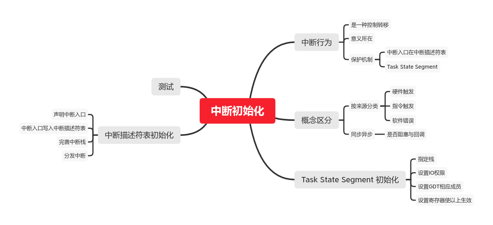

#! https://zhuanlan.zhihu.com/p/213873367
# MIT 6.828：实现操作系统 | Lab 3A：中断初始化

本文为本人实现`6.828 Lab`的笔记，接续上一篇：

[MIT 6.828：实现操作系统 | Lab 3A：为进程加载ELF文件](https://zhuanlan.zhihu.com/p/194501828)

`Lab`其他部分在专栏不定期更新，环境搭建请看第一篇：

[MIT 6.828：实现操作系统 | Lab1：快来引导一个内核吧](https://zhuanlan.zhihu.com/p/166413604)

本文思维导图：



本文md文档源码链接：[AnBlogs](https://github.com/Anarion-zuo/AnBlogs/blob/master/6.828/lab3A-trap.md)

# `x86`中断行为

如果你之前没有底层开发经验，务必仔细了解处理器的中断机制，务必认真阅读[x86手册第九章](https://pdos.csail.mit.edu/6.828/2018/readings/i386/c09.htm)和[x86手册第七章](https://pdos.csail.mit.edu/6.828/2018/readings/i386/c07.htm)。如果说前面的`Lab`还可以依靠从前系统编程的经验支撑，到这里就不得不更深入理解原理了。这个标题下的内容为我对[x86手册第九章](https://pdos.csail.mit.edu/6.828/2018/readings/i386/c09.htm)的理解，只写了对后面写代码有帮助的部分，其它部分只作简单理解，不作深入掌握了。

## 中断是控制转移

中断是一种控制转移`control transfer`机制，可以联系`call`，同样也是控制转移机制。我们可以看到两者包含的平行概念。

`call`指令需要指定一个函数，也就是一个地址。中断需要指定**中断类型**，也就是中断发生的原因，以及对应的**中断序号**，也称为**中断向量**。它们都需要知道向哪里跳转。

`call`指令将执行前的运行状态保存，中断也要进行类似的压栈。它们都需要知道向哪里返回，如何恢复之前的执行。

`call`指令调用后，处理器继续使用原来的栈，通常使用`ebp`标记新的开端。中断发生后，处理器使用事先指定好的另一个栈。它们都需要一个**新的**栈环境，即便相比之下不是一样的**新**。

## 中断的意义

我们需要中断，因为我们要让CPU从**用户态**进入**内核态**。

**用户态**是各个进程所在的状态，不能直接操作硬件，只能进行非常有限的操作，从而使得一个进程出现错误时，不会影响其他进程。进程通常只能访问指定范围内的地址，不能直接操作各种外设，像*在屏幕上显示字符*这样的操作，必须通过**系统调用**`System Call`，通过内核完成。

进程必须能够进行**系统调用**，否则整个计算机的功能就因为操作系统受到了严重限制，丧失了设计的意义。要进行**系统调用**，就必须获得比**用户态**更多的权限，就必须从**用户态**进入**内核态**。

然而，中断必须在**被保护**的状态下进行，中断处理函数不能由用户进程指定，否则也就没有保护的意义了。接下来介绍保护机制。

## 保护中断

中断保护由两个机制组成。

### 中断入口

一个保护机制是**中断处理函数**，或者叫做**入口**。这个函数在**中断描述符表**中指定，中断发生时，处理器跳转到这个函数开始执行。中断只能令处理器跳转到指定好的函数，设置**中断处理函数**的操作只能在**内核态**下进行，这样也就实现了保护。

**中断描述符**是**中断描述符表**的成员，包含了和中断处理函数入口有关的信息。有三种结构，对应三种中断类型，如下：


在文件`inc/mmu.h`中，定义了一些结构体和宏，帮助我们操作给定的**中断描述符表**。主要初始化在函数`trap_init`中完成。

### `Task State Segment`

另一个保护机制是**任务状态**`Task State Segment`。由它的名字，它存储在一个`Segment`中，这个`Segment`在`Global Segment Table`，有一个对应的`selector`。我们没有使用`Segment`有关的内存映射机制，但是我们使用了它的权限保护机制。这个`Segment`放置了中断发生后，处理器应使用哪个栈，也就是寄存器`ss, esp`的值。同时也通过`Selector`指明了这个`Segment`要求的权限，限制一些中断入口的进入方式。

中断发生后，处理器将之前的执行状态保存在`Task State`指定好的**栈**中，以便之后能够返回到指定状态继续执行。中断触发后，处理器把当前栈顶切换到这个栈，并压入相应信息。这些信息不能在**用户态**下改变，否则程序可以跳转到任意想要跳转的地方，并且可能获得**内核态**权限。幸运的是，只要我们将`Task State Segment`的权限设置为**内核态**，就可以保护它。

压栈的信息如下，发生权限变化和不发生的情况有所不同。


可以看到，权限变化时，往栈上压入了更多信息。压栈顺序非常重要，这也就是结构体`struct Trapframe`的声明顺序。注意到，结构体开头声明的几个属性不在图中，故我们在`trapentry.S`中自己把那些信息压栈。将此时的栈顶设置为`struct Trapframe`指针，也就可以方便地访问一个现成的结构体，包含关于中断前处理器状态的所有信息。

具体的初始化和使用在后文实现。

`JOS`不重度使用**中断处理函数**或`Task State`，没有完全使用这些硬件机制。

我们可以在**中断描述符表**中指定好每个中断的入口，从而方便地使用这一硬件功能，但是我们没有这么做。我们让所有的中断最终跳转到一个相同的处理函数，在这个函数中通过`switch`手动分发这些中断。

我们可以使用`Task State Segment`指定别的地址作为**系统调用**的栈，但是我们没有这么做。我们使用了内核的栈`KSTACKTOP`当做中断栈。

# 区分一些概念

和中断有关的概念经常容易搞混，不同作者有不同的预设。这里整理一下有关概念。

从代码层面来看，**中断**和**异常**没有本质上的区别。我们不是硬件工程师，也就不去深究它们的区别，用**中断**同时指代两者。可以对中断稍微分类，加深理解。

中断通常有3种来源，**硬件触发、指令触发和软件错误**。硬件触发如外设电路将CPU引脚电平拉高，如DMA完成内存操作，常用于**IO设备控制**。指令触发常用在实现**系统调用**中，通过指令`int`在代码中触发处理器中断，从而进入**内核态**。其余的错误可统称为**软件错误**，可能是遇到了*无法执行的指令*，如`Divide By 0`，也可能是触发了保护机制，如`Page Fault`。

也可以采用另一种分类加深理解，可以分为**同步**和**异步**。和其他语境类似，**异步**的意思是，中断是对之前一种**信号**的**回应**`response`。如CPU要向硬盘写入数据，于是给总线上其它设备分发了这个任务。相应设备完成之后，告诉CPU**完成**这个信息，也就是触发中断。CPU相应执行的中断处理，可以看做**回调函数**。在发出**信号**和收到**回应**之间，CPU的执行不阻塞。

相对地，**同步**代表中断发生后，CPU原先的执行被阻塞，切换到了**处理函数**。处理函数完成之后，再返回到原先被阻塞的`procedure`继续执行。

写代码时，我们不需要关心中断的具体分类，只需要根据中断携带的信息，进行妥善处理就可以。

# `Task State`初始化

在函数`trap_init_percpu`中，初始化了处理器的`Task State Segment`和**中断描述符表**。这个函数在`trap_init`函数中调用，在写好一系列**中断描述符表初始化**操作之后，调用这个函数，令**中断描述符表**生效，并初始化`Task State`。

`Task State`中指定了要使用的栈，在`trap_init_percpu`中这样初始化：

```c
ts.ts_esp0 = KSTACKTOP;
ts.ts_ss0 = GD_KD;
```

接着设置了`IO`操作的权限，我们不关心这里的细节。

```c
ts.ts_iomb = sizeof(struct Taskstate);
```

然后把这个`Task State Segment`装载进`Global Segment Table`。回想`Segment Table Selector`的格式如下：


宏`GD_TSS0`定义了`Task State Segment`对应的**选择器**，要获得对`gdt`的索引，需要右移3位，如下：

```c
gdt[GD_TSS0 >> 3] = SEG16(STS_T32A, (uint32_t) (&ts), sizeof(struct Taskstate) - 1, 0);
gdt[GD_TSS0 >> 3].sd_s = 0;
```

最后设置寄存器，令以上配置生效。

目前为止，这个函数是为处理**一个**CPU初始化而设计的。下一个`Lab`要操作**多个**CPU，也就需要修改这个函数了，不过道理都是类似的。

# 中断描述符表初始化

我们想要的效果是，一个中断产生之后，根据这个中断的类型和携带的参数，执行相应的处理函数。大概对应`Lab 3 Exercise4`实现。初始化操作集中在函数`trap_init`和文件`trapentry.S`中。

## 中断统一入口

每个中断都对应了一个入口，写在**中断描述符表**中。在`trap_init`函数中，借助宏`SETGATE`配置**中断描述符表**。务必看清楚文件`mmu.h`中关于这个宏的说明，每个参数的含义。

在使用`SETGATE`配置中断描述符表之前，先要有中断入口函数。这些函数写在`trapentry.S`中。每个中断都有一个入口函数，我们可以在这里就给每个中断写入口函数。将函数的符号声明为**全局**`global`，也就可以在文件`trap.c`中的C代码获得函数指针。通过这些函数指针就可以初始化**中断描述符表**。

`Lab`在文件`trapentry.S`中提供了两个宏`TRAPHANDLER*`，对所有中断进行了统一处理。让所有中断经过一个统一的流程后，再通过C代码分发处理函数，而不是直接在`trapentry.S`中单独写每个中断的处理函数。

```assembly
#define TRAPHANDLER(name, num)						\
	.globl name;		/* define global symbol for 'name' */	\
	.type name, @function;	/* symbol type is function */		\
	.align 2;		/* align function definition */		\
	name:			/* function starts here */		\
	pushl $(num);							\
	jmp _alltraps
```

这个宏做了这些事情：

1.  创建一个函数`symbol`，名字由宏参数得到。
2.  将这个`symbol`设置为全局。
3.  这个函数将中断序号压栈，并跳转到`_alltraps`。

有的中断会将一个额外的`error code`压栈，在进入**中断描述符表**指定的入口函数之前，就和其他数据一起压栈了。有的中断不会进行这个操作。为了统一处理这两种中断，使得它们的栈具有相同形式，对于不进行压`error code`操作的中断，我们在原本`error code`的位置压一个0填充，正如宏`TRAPHANDLER_NOEC`中的那样。哪些中断会自动压`error code`，请看[x86所有异常](https://pdos.csail.mit.edu/6.828/2018/readings/i386/s09_08.htm)。

宏`TRAPHANDLER*`接受两个宏参数，一个是要生成的中断入口名字，一个是中断序号。中断序号在文件`inc/trap.h`中有一系列宏声明，对应了一系列我们感兴趣的中断。查`manual`之后，就可以在文件`trapentry.S`中创建一系列函数。

```c
TRAPHANDLER_NOEC(t_divide, T_DIVIDE)
TRAPHANDLER_NOEC(t_debug, T_DEBUG)
TRAPHANDLER_NOEC(t_nmi, T_NMI)
TRAPHANDLER_NOEC(t_brkpt, T_BRKPT)
TRAPHANDLER_NOEC(t_oflow, T_OFLOW)
TRAPHANDLER_NOEC(t_bound, T_BOUND)
TRAPHANDLER_NOEC(t_illop, T_ILLOP)
TRAPHANDLER_NOEC(t_device, T_DEVICE)
TRAPHANDLER(t_dblflt, T_DBLFLT)
TRAPHANDLER(t_tss, T_TSS)
TRAPHANDLER(t_segnp, T_SEGNP)
TRAPHANDLER(t_stack, T_STACK)
TRAPHANDLER(t_gpflt, T_GPFLT)
TRAPHANDLER(t_pgflt, T_PGFLT)
TRAPHANDLER(t_fperr, T_FPERR)
TRAPHANDLER(t_align, T_ALIGN)
TRAPHANDLER(t_mchk, T_MCHK)
TRAPHANDLER(t_simderr, T_SIMDERR)

TRAPHANDLER_NOEC(t_syscall, T_SYSCALL)
```

我们使用这两个宏创建所有中断的入口，故所有中断都要跳转到`_alltraps`，同时每个中断入口的创建形式都相同，也就具有了实际上的**中断统一入口**。

## 初始化中断描述符表

在函数`trap_init`中，将刚刚写好的一系列入口，以**函数指针**的形式，写进**中断描述符表**。

给宏`SETGATE`传函数名和对应的中断序号即可，在使用函数名之前，必须先声明函数，告诉连接器要使用来自另一个文件的`symbol`。如要初始化`Divide By 0`：

```c
void t_divide();
SETGATE(idt[T_DIVIDE], 0, GD_KT, t_divide, 0)
```

为了方便，再写一个宏，再封装一层：

```c
#define DECLARE_INTENTRY(funcName, intNumber, privLevel) \
    void funcName();                \
    SETGATE(idt[intNumber], 0, GD_KT, funcName, privLevel)
```

根据`SETGATE`第二个参数的不同，还要另外写一个宏：

```c
#define DECLARE_TRAPENTRY(func_name, entry_num, privLevel) \
    void func_name();                \
    SETGATE(idt[entry_num], 1, GD_KT, func_name, privLevel)
```

`Interrupt Entry`和`Trap Entry`的区别在于，是否在中断返回之前阻止新的中断产生。目前为止，这个区别造成的后果还不显著。

各个中断初始化应如下：

```c
DECLARE_INTENTRY(t_divide, T_DIVIDE, 0)
DECLARE_INTENTRY(t_debug, T_DEBUG, 3)
DECLARE_INTENTRY(t_nmi, T_NMI, 0)
DECLARE_TRAPENTRY(t_brkpt, T_BRKPT, 3)
DECLARE_INTENTRY(t_oflow, T_OFLOW, 0)
DECLARE_INTENTRY(t_bound, T_BOUND, 0)
DECLARE_INTENTRY(t_illop, T_ILLOP, 0)
DECLARE_INTENTRY(t_device, T_DEVICE, 0)
DECLARE_INTENTRY(t_dblflt, T_DBLFLT, 0)
DECLARE_INTENTRY(t_tss, T_TSS, 0)
DECLARE_INTENTRY(t_segnp, T_SEGNP, 0)
DECLARE_INTENTRY(t_stack, T_STACK, 0)
DECLARE_INTENTRY(t_gpflt, T_GPFLT, 0)
DECLARE_INTENTRY(t_pgflt, T_PGFLT, 3)
DECLARE_INTENTRY(t_fperr, T_FPERR, 0)
DECLARE_INTENTRY(t_align, T_ALIGN, 0)
DECLARE_INTENTRY(t_mchk, T_MCHK, 0)
DECLARE_INTENTRY(t_simderr, T_SIMDERR, 0)

DECLARE_TRAPENTRY(t_syscall, T_SYSCALL, 3)
```

还需要特别说明的是宏`DECLARE_INTENTRY`的第三个参数，指定了权限`DPL`。对于部分通过`int`指令触发的中断，只有在大于指定的权限状态下触发中断，才能进入中断入口函数。如在**用户态**下触发权限为`0`的`T_DEBUG`中断，就不能进入入口，反而会触发`GPFLT`中断。更详细的解释，请看[x86手册7.4](https://pdos.csail.mit.edu/6.828/2018/readings/i386/s07_04.htm)。

我们将一些入口`DPL`设置为3，允许它们通过`int`触发。

`GPFLT`中断为所谓的**兜底**，要是产生的错误没有对应其它中断，就会触发这个中断。在这里，中断尝试从**用户态**进入一个只能由**内核态**进入的入口，就会触发这个中断，作为一种保护机制。

具体哪些情况会触发`GPFLT`，请看[x86手册9.8.13](https://pdos.csail.mit.edu/6.828/2018/readings/i386/s09_08.htm)。

到这里，中断还不能正常执行，我们还需要写写`trapentry.S`中的汇编代码。

## `_alltraps`

从`_alltraps`开始，每个中断都会走过相同的代码。`Lab`要求我们在`_alltraps`中进行如下操作：

1.  让更多信息进栈，使得栈具有结构体`struct TrapFrame`的形式。
2.  在寄存器`%ds, %es`的位置上放置宏`GD_KD`的值。
3.  将当前栈指针压栈，给`trap`函数传参。
4.  调用`trap`函数。

总的来说，这段代码的意义就是**正确地向`trap`函数传参**，重点在把栈制作得和一个`struct TrapFrame`一样。

其实我们离答案很近。翻到上文的一张图片，可以发现，中断产生时，处理器已经自动压了一部分信息到栈上。


联系`struct TrapFrame`的声明，可以看到，从最后一个元素，寄存器`ss`的值，到结构体的第8个声明的属性`uintptr_t tf_eip`，处理器都已经压好了。在进入`_alltraps`之前，前面的代码还处理好了`error code`和`trap number`，现在仅剩`tf_ds, tf_es, tf_regs`需要处理。

`Lab`讲义中说得很明确，要给`ds, es`寄存器传宏`GD_KD`的值，这又解决了一个问题。以上一瞬间解决了几乎所有需要处理的`struct TrapFrame`成员，可以写出前半部分代码如下。

```assembly
_alltraps:
    pushl %ds
    pushl %es
```

剩下的`struct PushRegs`结构体，可以直接通过`popa`指令构造。`pusha`指令意为`push all registers`，将所有寄存器的值压栈，顺序正好对应`struct PushRegs`的声明顺序。

再接着将`GD_KD`的值赋值给寄存器`ds, es`，就可以调用`trap`函数了。完整代码如下：

```assembly
_alltraps:
    pushl %ds
    pushl %es
    pushal
    # load GD_KD into %ds, %es
    movw $(GD_KD), %ax
    movw %ax, %ds
    movw %ax, %es
    # pass a pointer to the trap frame for function trap
    pushl %esp
    call trap
```

`call`指令的前一个指令，就是将当前栈指针压栈了，就是在给`trap`函数传参。在文件`kern/trap.c`中的`trap`函数中，函数接受的参数`tf`，就是这样传进来的。

可以想想为什么这样传参是对的。栈的生长方向是虚拟地址变小的方向，访问结构体是在一个**基地址**的基础上**加上**一个偏置。我们按照结构体声明的相反顺序，将结构体成员的值压栈，而最终指向结构体的指针，比任意结构体成员的地址都要小。这样想一下，是一个不错的`sanity check`。

仔细阅读`trap`函数的代码，可以看到，若中断是在用户态下触发，就要对`tf`指针指向的结构体，也就是刚刚压栈的那个结构体，进行拷贝，从而控制用户态下的不安全因素。

拷贝完结构体之后，调用函数`trap_dispatch`，将中断分发到指定的`handler`处理。

# 测试配置

`kern/init.c`中调用了宏函数`ENV_CREATE`，从而指定了在之后的`env_run`中要执行的进程。可以执行的进程在`user`目录下的一系列C文件中写好了，都非常简单。给`ENV_CREATE`传`user_*`，`*`处填写对应在`user`目录下的文件名，就可以了。一开始使用的是`user_hello`，就是对应`user/hello.c`。

我们尝试改成`user_divzero`，试图从用户态触发`Divide By 0`异常。可以在文件`trapentry.S`或函数`trap`中设置断点，感受中断执行流程。

如果配置正确，在函数`env_run`调用`env_pop_tf`之后，处理器开始执行`trapentry.S`下的代码。应该首先跳转到`TRAPENTRY_NOEC(t_divide, T_DIVIDE)`处，再经过`_alltraps`，进入`trap`函数。

可以使用`Lab`提供的打分测试。在根目录下运行`make grade`，若之前操作正确，则`Lab 3A`下会有相应分数。这个打分测试是运行了一个`Python`脚本`grade-lab3`。如果你之前没有这么做的话，你可以回到之前的`Lab`跑一下之前相应的打分。看看自己能的几分。

# 接着看运行流程

再仔细看看`trap`函数及其调用的函数的行为。

进入`trap`函数后，先判断是否由用户态进入内核态，若是，则必须保存进程状态。也就是将刚刚得到的`TrapFrame`存到对应进程结构体的属性中，之后要恢复进程运行，就是从这个`TrapFrame`进行恢复。

若中断令处理器从内核态切换到内核态，则不做特殊处理，详情请看[x86 Nested Interrupt](https://pdos.csail.mit.edu/6.828/2018/labs/lab3/#Nested-Exceptions-and-Interrupts)。

接着调用分配函数`trap_dispatch`，这个函数根据**中断序号**，调用相应的处理函数，并返回。故函数`trap_dispatch`返回之后，对中断的处理应当是已经完成了，该切换回触发中断的进程。修改函数`trap_dispatch`的代码时应注意，函数后部分不应该执行，否则会销毁当前进程`curenv`。中断处理函数返回后，`trap_dispatch`应及时返回。

切换回到旧进程，调用的是`env_run`，根据当前进程结构体`curenv`中包含和运行有关的信息，恢复进程执行。如运行`user_divzero`之后，若对错误不作任何处理，重新恢复执行进程后，进程尝试重新执行之前的指令，进而重新触发`Divide By 0`中断，造成死循环。