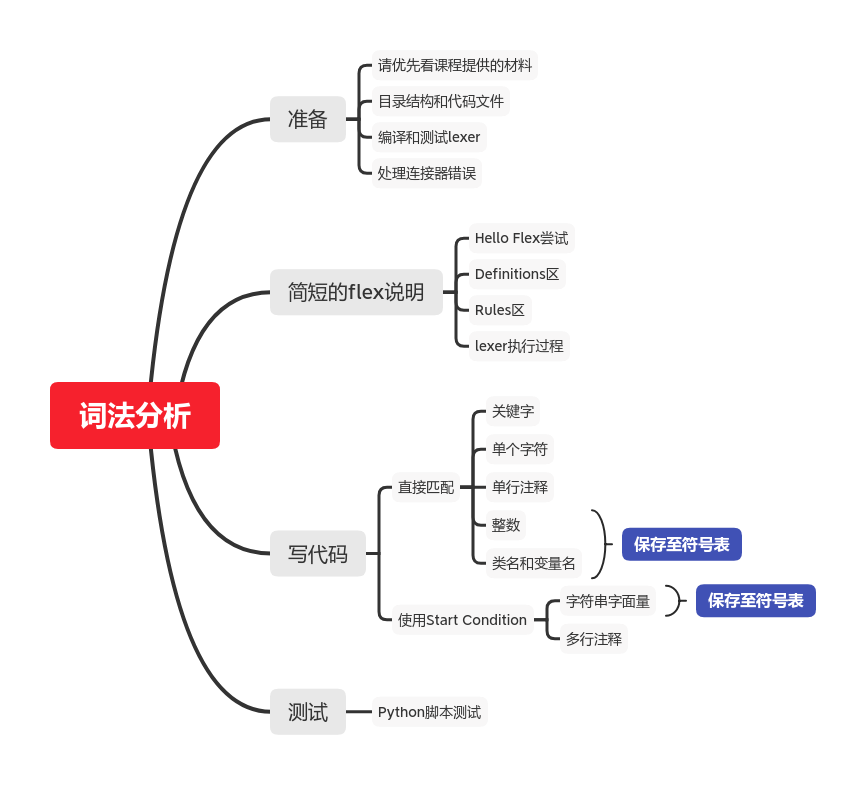

#! https://zhuanlan.zhihu.com/p/258385544
# CS143：编译原理｜PA2：正则表达式和词法分析

这是本人实现斯坦福`CS143`编程作业的笔记，对应第二次作业`PA2`。有关文章目录、环境搭建和一些说明请看第一篇：[CS143：编译原理 | 环境搭建HelloWorld](https://zhuanlan.zhihu.com/p/226190284)

从`PA2`开始，`CS143`的编程作业正式进入写编译器环节。经过四次作业，最终将实现编译器的主要部分。本文实现`Lexical Analyzer`，也就是**词法分析**。

鉴于我们在写`Cool`语言编译器，你可能想要熟悉以下`Cool`语言的语法，可以看上一篇[CS143：编译原理｜PA1：熟悉Cool语言](https://zhuanlan.zhihu.com/p/250667235)

这个`PA`的主要文件存放在`assignments/PA2`下，说明文档在`handouts/PA2.pdf`，还有一些需要的头文件在`include/PA2`。再次提醒你，我选择`C`语言完成`CS143`的各个`PA`，故本文使用的工具是`flex`，而不是`jlex`，使用的文件都在`PA2`目录下，而不是`PA2J`目录。如果你更喜欢`Java`，可以进行自己的尝试。

你需要在`Linux`环境下安装`flex`，否则无法进行一些编译执行。我一开始使用了包管理工具直接安装最新版`flex`，出现了一些链接错误。这是新版本`flex`对`C/C++`之间的切换不够兼容导致的。如果你也遇到了类似问题，不要安装最新版`flex`，而是安装课程官方虚拟机中使用的版本`2.5.35`，这个问题就消失了。其它工具同理，最好使用和课程材料版本一致的工具。

本文md文档源码链接：[AnBlogs](https://github.com/Anarion-zuo/AnBlogs/blob/master/cs143/pa2-lexical.md)

本文涉及的代码已经全部嵌入文章，如果你想要的完整代码，请看[这个GitHub仓库](https://github.com/Anarion-zuo/Stanford-CS143/tree/master/assignments/PA2)。在链接指向的目录下可以直接运行测试用例。

本文涉及的内容非常多，我尽量充分地解释。如果你的知识背景和我类似，阅读本文应该很容易。否则可能很困难。你可以对照这下面的思维导图辅助理解。



编译器是个庞大而复杂的项目，我很可能在代码中犯一些小错误、或是没有考虑到一些`Corner Case`，如果你发现了，请一定提醒我。感谢各位捧场。

# 任务总览和一些准备

本文假设你已经对编译原理词法分析的有关知识有一定认识，起码阅读过虎书/龙书相关章节。你应该知道，词法分析是编译流程最前端的流程，通过**正则表达式匹配**将一系列字符流转化为`token`流。这就是这个`PA`要我们完成的词法分析。

举个例子，下面这段`Cool`代码：

```
class CellularAutomaton inherits IO {
    population_map : String;
```

被转化为：

```
#5 CLASS
#5 TYPEID CellularAutomaton
#5 INHERITS
#5 TYPEID IO
#5 '{'
#6 OBJECTID population_map
#6 ':'
#6 TYPEID String
#6 ';'
```

其中，`class`关键字被转化为一个`CLASS token`，类名`CellularAutomation`被标注为`TYPEID`，属性名`population_map`被标注为`OBJECTID`等等。原代码中的每个**成分**都被转化成了更高级的**抽象**。

进入目录`assigments/PA2`，运行`make lexer`，在当前目录下产生了一个可执行文件`lexer`。运行这个`lexer`，并给它传一个文件路径，如`./lexer test.cl`，就是让它对指定的代码进行词法分析。若代码逻辑正确，将会得到形如上面代码块一样的输出。完善文件`cool.flex`，就是让我们的`lexer`越来越好。目前一点代码还没写，这样编译得到的`lexer`也可以进行一定输出。

书写`cool.flex`需要我们对`flex`有一定了解。后文中，我适当讲解`flex`的格式，然而，我还是建议你先通读[官方文档](http://westes.github.io/flex/manual/index.html)，以及`handouts`目录下的一些`PDF`。这些材料文字量非常大，你可以把阅读过程当做锻炼快速提取信息的练习，或是单纯地练习英语。无论如何，这个过程是非常重要的。

项目给我们提供了测试用例`test.cl`，以及一个完整的`lexer`。这个`lexer`可以完全正确地对`Cool`代码进行词法分析，并输出形如上面代码块的信息，我们称之为**标准`lexer`**。若我们的`lexer`和**标准`lexer`**的输出一致，则认为我们取得了成功。

标准`lexer`在`bin`目录下，你可能在进行环境搭建的时候，把标准`lexer`和其它文件一起拷贝到了`/usr/class`目录下，并将其添加至环境变量。无论如何，运行这个`lexer`，并给它传递`test.cl`测试用例，可得到形如上面代码块的输出。

我写了一个简单的`Python`脚本，用来比较我们的`lexer`和标准`lexer`的输出。

```python
#!/usr/bin/python3
# test_compare.py
import os
myOutput = os.popen("make dotest").read()
stdOutput = os.popen("lexer test.cl").read()

beginIndex = myOutput.index("#name")
myOutput = myOutput[beginIndex:]

while True:
    myEnd = myOutput.index("\n")
    stdEnd = stdOutput.index("\n")
    if myOutput[0 : myEnd] != stdOutput[0 : stdEnd]:
        print("my flex ", myOutput[0 : myEnd])
        print("std flex", stdOutput[0 : stdEnd])
        print("")
    myOutput = myOutput[myEnd + 1 :]
    stdOutput = stdOutput[stdEnd + 1 :]
```

以上`Python`代码将和标准`lexer`输出不同的部分显示，方便我们查找错误。

这样一来，我们的开发流程就是，调整`cool.flex`，运行`Python`脚本，再调整`cool.flex`，直到输出和标准`lexer`相同。

在正式开始研究`flex`之前，我们先看看`assignments/PA2`目录下的各个代码文件，是如何被编译成`lexer`可执行文件的，以及处理一些小错误。

# 编译`lexer`

## 涉及的文件

这里研究`lexer`的编译过程，以求对整个项目有更深的理解，多数信息来自目录`assignments/PA2`下`Makefile`。

执行`make dotest`，将编译`lexer`，并使用这个`lexer`对`test.cl`进行词法分析。这是测试指令，也是上面`Python`代码执行的指令。

编译`lexer`要执行`make lexer`，将一系列C代码编译。其中，`cool-lex.cc`是`flex`通过`cool.flex`生成的，包含词法分析的主要流程；`lextest.cc`包含`main`入口，主要的命令行输出在这里进行；其余文件都是辅助性代码。

`flex`的作用就是将`.flex`格式的文件转化为`C`代码，作为库函数和其它文件一同编译。`lextest.cc`调用了`cool.flex`生成的代码，之后的`PA`中，调用这个代码的可能是编译器的其它组件。

## 一些小修改

这时你使用`make dotest`或`make lexer`构建项目，会出现类似以下错误：

```
g++ -g -Wall -Wno-unused -Wno-write-strings -I. -I../../include/PA2 -I../../src/PA2 lextest.o utilities.o stringtab.o handle_flags.o cool-lex.o -lfl -o lexer
/usr/bin/ld: lextest.o: in function `main':
/home/anarion/Projects/lab/cs143/assignments/PA2/lextest.cc:82: undefined reference to `cool_yylex()'
collect2: error: ld returned 1 exit status
```

在本文的开头，我提醒你不要使用最新版本`flex`，可以解决部分问题。这里还需要将涉及到的文件进行修改。上面的报错信息中，错误出现在文件`lextest.cc`，我们需要在这个文件中把函数`cool_yylex`的声明修改成如下形式，告诉编译器应将`cool_yylex`作C函数处理。

```c
extern "C" int cool_yylex();
```

若其它文件中也出现了这样的`undefined reference`错误，作同样修改即可。

# 简短的`flex`说明

这里开始正式研究`flex`，说是“正式”，其实很不充分，只是把我在写代码过程中关注到的点说明一下。还是建议你阅读[Flex官方文档](http://westes.github.io/flex/manual/index.html#SEC_Contents)和`handouts/PA2.pdf`，不要只看本文。

`flex`将符合指定格式的文件，转化为C代码，用于进行**词法分析**`Lexical Analysis`。在`.flex`文件中，我们通过设置**正则表达式**，定义了一些**词汇**`lexeme`，这些词汇将被转化为抽象的符号`token`，作为词法分析的结果。我们要搞清楚`.flex`文件的格式，正确设置正则表达式，才能写出正确的`lexer`。

一个`flex`文件由3部分组成，在文件`cool.flex`中也有体现。每个部分之间用`%%`隔开。

```
definitions
%%
rules
%%
user code
```

其中，`definitions`和`user code`是C文件常出现的两个部分。在`user code`中，我们定义一些函数，可能在这个文件中使用，也可能在其它文件使用。在`definitions`中，我们包含头文件、定义全局变量、定义结构体、定义宏，做了`user code`区没做的事情。我们平时写的C文件大多数都可以分成这样的两部分，在`.flex`文件中对这两部分的处理就像在`.c`文件中一样，该怎么写就怎么写。

更重要的是`rules`区，我们在这里写正则表达式。每个正则表达式后跟着一个`{}`定义的代码块，每当这个正则表达式达到匹配，就会执行这个代码块。

我们的主要工作集中在`rules`区，设置各个正则表达式和对应的处理代码块。`definitions`区内容大多已经给好，我们之后按需添加少许代码。`user`区我暂时不使用，你也可以使用，将重复代码段提出作为函数，令代码更加优雅。

## Hello Flex

为了让你安心，我们先来看一个简单的`HelloWorld`级例子。

在还是空白的`rules`区添加以下代码：

```c
.* {
	cout << "Hello Flex" << endl;
}
```

注意，右括号`}`和行首之间没有空格，正则表达式`.*`和左括号`{`之间有**一个**空格、和行首之间没有空格。这些空格很重要。编译执行，得到一堆`Hello Flex`输出。

正则表达式`.*`匹配内容为**每一行、任意字符、任意长度**的字符串，故所有的行都被匹配到这个正则表达式，输出的`Hello Flex`个数为`test.cl`的行数。

你可能好奇，为什么没加`std::`或`using namespace std`也能使用`cout`输出，答案在文件`include/PA2/cool-io.h`。

你可能也好奇，生成的文件长什么样子，答案在文件`cool-lex.cc`，你可以拿这个文件和`cool.flex`文件比较。后面写了更复杂的`cool.flex`，也可以常常和编译生成的`cool-flex.cc`比较。

下面我们看看更多细节。以下介绍只是`Get Started`，帮助你以**最小努力**获得**开始**这个`PA`的知识，更多细节一定要看官方文档。

## `Definitions`区格式

这个部分由两种代码组成，一种是**C代码**，一种是**flex定义**。

要写`C`代码，可以让代码缩进，也可以写在`%{`和`%}`定义的代码块中。后者是`cool.flex`中已有代码选择的方案。前者容易令人困惑，因为**缩进**的长度容易被忽略，导致同一文件中缩进长度不一致，最好不要依赖缩进进行语法声明。

正如`cool.flex`开头的注释所说，`%{%}`包含的内容，会被原封不动地拷贝到输出文件C代码中。我们要像写真正的C代码一样写`Definitions`区中的C代码。

`flex`定义是其它内容，不是C代码的内容都是`flex`定义。定义的格式为：

```
name definition
```

也就是对一个可能重复出现的表达式命名，类似于宏定义，如`DARROW =>`，则在`Rules`区中，所有的`DARROW`都被理解为`=>`。

我进行了一些定义，主要是一些`Cool`语言的简单关键字，在后面的代码中使用。

```
DARROW          =>
CLASS           class
ELSE            else
FI              fi
IF              if
IN              in
INHERITS        inherits
LET             let
LOOP            loop
POOL            pool
THEN            then
WHILE           while
CASE            case
ESAC            esac
OF              of
NEW             new
ISVOID          isvoid
ASSIGN          <-
NOT             not
LE              <=
```

## `Rules`区格式

`Rules`区格式在上面的`Hello World`例子中已经体现得很充分了。正则表达式在新的一行的开头写，和行首之间一定**没有空格**，否则这些空格被当做正则表达式的一部分。正则表达式之后的代码块和正则表达式之间一定**有空格**，否则`{`被当做正则表达式的一部分。

代码块中写的是C代码，根据有没有返回值，代码行为有所不同。有返回值的代码块，被匹配的字符串会被做成一个`token`，并提交给上层代码。无返回值的代码块，执行完代码块后忽略这一段匹配到的字符串，`Cool`语言中的**注释**应该这样处理。

写在`flex`中的多行注释在开头应添加缩进，如下：

```c
  /*
    Type Identifiers
    begin with a capital letter
  */
```

缩进可以是任意个数的空格，上面代码中的就是2个，但决不能是0个。若不添加缩进，则`/*`和其它行首字符可能被当做正则表达式处理。

## 执行`lexer`

阅读文件`lextest.cc`，可以感受`flex`产生的C代码是如何被调用的。

每次调用`cool_yylex`，也就是`yylex`函数，进行了一次匹配尝试，得到一个`token`，且全局变量`cool_yylval, curr_lineno`可能在`cool_yylex`执行的时候被修改。`token, cool_yylval, curr_lineno`就是一次匹配得到的所有信息，代表**匹配了什么语句、语句包含了什么额外信息、语句在哪一行**，匹配的行为由`cool.flex`中的代码决定。通过函数`dump_cool_token`输出这些信息，得到形如本文开头代码块中的输出。

到这里，你应该做好足够的准备了，可以正式开始写**词法分析**。

# 写正则表达式和处理代码块

我们开始写`cool.flex`的`Rules`区，向着`PA2`的要求前进。

词法分析就是对不同的**语句**作不同的处理，**语句**由**正则表达式**规定，**处理**由语句后的代码块规定。总的来说，我们需要处理这么几类语句：

-   关键字，组成的字符串固定，如`if, fi, else`。
-   整数、字符串，需要`lexer`记录额外信息，如整数值、字符串内容。
-   注释和空格，应忽略，不生成`token`。
-   各种符号，类型名`Type ID`、变量名`Object ID`。
-   非法字符，如`[, ], >`。
-   换行符，应更新表示当前行号的全局变量`curr_lineno`。

具体的`specification`请看`handouts/PA2.pdf`和`handouts/cool-manual.pdf`，里面的描述非常完备。

这里需要提醒你，目前为止，我还没有完善测试用例`test.cl`，一些`Corner Case`表现可能不正确，但没有在测试中表现出。如果你发现了不完善的地方，请一定在评论区告诉我。

**词法分析**的难点在于**完整**和**正确**，要包含代码中所有可能出现的情况，并对所有情况都进行正确处理。你可能花费很多时间在**完整**或**正确**其中之一，但这一定是值得的。由于**词法分析**本身自带的复杂属性，以及对**完整**及其严苛的要求，要是我有一些疏漏，请一定提醒我。

## 处理固定字符关键字

`Cool`语言中，**关键字**字符非常固定，如`if, fi, else, while`。我们可以使用简单`trivial`的正则表达式进行匹配。

所有关键字在文件`include/PA2/cool-parse.h`中，定义在`enum yytokentype`枚举类型和这个枚举类型下面几行的宏定义，从`STR_CONST`往上的所有定义都是关键字，都应该按关键字本身进行匹配。

在匹配之前，我们先给这些关键字起名字，写在`Definitions`区。

```
DARROW          =>
CLASS           class
ELSE            else
FI              fi
IF              if
IN              in
INHERITS        inherits
LET             let
LOOP            loop
POOL            pool
THEN            then
WHILE           while
CASE            case
ESAC            esac
OF              of
NEW             new
ISVOID          isvoid
ASSIGN          <-
NOT             not
LE              <=
```

然后在`Rules`区写正则表达式：

```c
{DARROW} { return (DARROW); }
{CLASS} { return (CLASS); }
{ELSE} { return (ELSE); }
{FI} { return (FI); }
{IF} { return (IF); }
{IN} { return (IN); }
{INHERITS} { return (INHERITS); }
{LET} { return (LET); }
{LOOP} { return (LOOP); }
{POOL} { return (POOL); }
{THEN} { return (THEN); }
{WHILE} { return (WHILE); }
{CASE} { return (CASE); }
{ESAC} { return (ESAC); }
{OF} { return (OF); }
{NEW} { return (NEW); }
{ISVOID} { return (ISVOID); }
{ASSIGN} { return (ASSIGN); }
{NOT} { return (NOT); }
{LE} { return (LE); }
```

对应的关键字生成了对应的`token`。非常简单，不需要更多解释。

## 单个的合法字符和非法字符

和其它编程语言一样，`Cool`也接受一些单个字符。由于接受的合法字符很多，非法字符占少数，故使用`.`匹配所有字符，并将非法字符单独列出。

非法字符如下：

```c
[\[\]\'>] {
    cool_yylval.error_msg = yytext;
    return (ERROR);
}
```

合法字符可以直接返回字符本身的ASCII码：

```c
. {
    return yytext[0];
}
```

由于正则表达式`.`可能在很多情况下发生匹配，最好将它放在`cool.flex`靠后位置。根据`flex`的语法规则，放在`.`之后的匹配单个字符的正则表达式都将无法发挥作用。

一些代表空格的字符应该被忽略，由于它们的处理代码块相同，我们就把它们写在一起：

```c
[ \t\f\r\v]  {}
```

注意左中括号`[`后是个空格` `，不能省略这个空格，因为空格也是一个需要被忽略的字符。

还有一个特别的单个字符，就是换行`\n`，这个字符应该令当前行数+1：

```c
\n { ++curr_lineno; }
```

## 单行注释

我们先看单行注释，再看多行注释。和多行注释不同，单行注释可以直接被一个简单的正则表达式匹配，不需要额外复杂操作。

```c
--.*$ {}
```

这个正则表达式匹配一个以`--`开头的字符串，匹配至当前行的结尾，中间可为任意字符。末尾`$`可省略，因为`.*`不会匹配换行符。写在这里避免歧义。

这里不需要`++curr_lineno`，因为这个正则表达式没有匹配换行符，注释后的换行符会被马上匹配。

## 多行注释

处理多行注释和字符串时，我们需要**状态量**`Start Condition`，这是`flex`提供的语法糖，为我们提供相应的方便。

这里快速过一遍`Start Condition`这个语法糖。正则表达式之前写尖括号`<>`，其中写一个**状态量**，当这个状态量**成立**时，这个正则表达式才会被匹配。要使一个状态量**成立**，我们只需要在一个代码块中写`BEGIN(...)`。状态量使用之前要先**声明**，写在`Definitions`区。

要进行多行注释的处理，我们使用一个状态量`COMMENT`，并在`Definitions`区这样声明：

```
%x COMMENT
```

我们还用了一个全局变量，表示多行注释处理完成后，应该返回什么状态量，也写在`Definitions`区。

```c
static int commentCaller;
```

多行注释由`(*`触发：

```c
"(*" {
	commentCaller = INITIAL;
    BEGIN(COMMENT);
}
```

多行注释结束之后应该恢复初始状态量：

```c
<COMMENT>"*)" {
    BEGIN(commentCaller);
}
```

状态量不是`COMMENT`的时候，若找到`*)`，说明有错误：

```c
\*\) {
    cool_yylval.error_msg = "Unmatched *)";
    return (ERROR);
}
```

对于多行注释中的每个字符，都不生成`token`，遇到换行则需将表示**当前行**的全局变量递增：

```c
<COMMENT>[^(\*\))] {
    if (yytext[0] == '\n') {
        ++curr_lineno;
    }
}
```

在多行注释中看到`EOF`，说明有语法错误：

```c
<COMMENT><<EOF>> {
    BEGIN(commentCaller);
    cool_yylval.error_msg = "EOF in comment";
    return (ERROR);
}
```

## 类名和变量名

类名和变量名都是一种**符号**，携带了除**类别**`token`之外的其它信息，需要保存下来，提供给编译器的其它组件。类似的还有字符串字面量和整数字面量，都应该保存它们除了类别之外的其它信息。**类别**指如**类名、整数字面量**等等符号的类型，其它信息指**整数的数值、类名字符串**等等符号所携带的信息。

符号信息保存在**符号表**中，**符号表**的结构请看文件`include/PA2/stringtab.h`。已经定义好了3个全局变量，分别代表**类名变量名表、整数表、字符串表**，定义在`stringtab.h`末尾。

每个**符号表**都有一个`add_string`方法，给这个方法传字符串，就会尝试向符号表中添加一个符号，`StringTable`类的实现保证不会重复添加。

有了这些知识，就可以写符号匹配。类名`TYPEID`以大写字母开头，变量名`OBJECTID`以小写字母开头，以此区分两者。

```c
[A-Z_][A-Za-z0-9_]*  {
  cool_yylval.symbol = idtable.add_string(yytext, yyleng);
  return (TYPEID);
}
[a-z_][A-Za-z0-9_]*  {
  cool_yylval.symbol = idtable.add_string(yytext, yyleng);
  return (OBJECTID);
}
```

其中，还有特殊关键字，需要特别处理，写在上面两段代码之前，防止无法匹配。

**布尔常量**`true, false`，它们是特殊的`OBJECTID`，携带的信息直接进入全局变量`cool_yylval`。`cool-manual`提醒我们，它们的起始字母必须小写，但后面的字母可大写可小写。

```c
t[Rr][Uu][Ee] {
  cool_yylval.boolean = true;
  return (BOOL_CONST);
}

f[Aa][Ll][Ss][Ee] {
  cool_yylval.boolean = false;
  return (BOOL_CONST);
}
```

## 整数字面量

和类名一样，整数字面量可以直接被匹配，直接输入至**符号表**中。

```c
[0-9][0-9]* {
  cool_yylval.symbol = inttable.add_string(yytext, yyleng);
  return (INT_CONST);
}
```

## 字符串字面量

解析字符串字面量需要解析**多行注释**类似的知识，同样使用了**状态量**`Start Condition`。由于要处理字符串分行和转义符`\`等等特殊情况，比多行注释处理更加复杂一些。

定义了两个和字符串字面量有关的**状态量**：

```
%x STRING
%x STRING_ESCAPE
```

准备一个全局变量，存放读取到的字符串内容：

```c
static std::vector<char> stringArray;
```

在初始状态下的引号`“`触发进入`STRING`状态：

```c
\" {
    stringCaller = INITIAL;
    stringArray.clear();
    BEGIN(STRING);
}
```

当在没有转义符的情况下遇到引号`”`，字符串读取结束，应该返回：

```c
<STRING>[^\"\\]*\" {
    // push back string
    // does not include the last character \"
    stringArray.insert(stringArray.end(), yytext, yytext + yyleng - 1);
    // setup string table
    cool_yylval.symbol = stringtable.add_string(&stringArray[0], stringArray.size());
    // exit
    BEGIN(stringCaller);
    return (STR_CONST);
}
```

若遇见转义符，应进入转义符处理**状态**：

```c
<STRING>[^\"\\]*\\ {
    // does not include the last character escape
    stringArray.insert(stringArray.end(), yytext, yytext + yyleng - 1);
    BEGIN(STRING_ESCAPE);
}
```

只有很少转义符真正被解析成单个字符：

```c
<STRING_ESCAPE>n {
    // cout << "escape \\n !" << endl;
    stringArray.push_back('\n');
    BEGIN(STRING);
}

<STRING_ESCAPE>b {
    stringArray.push_back('\b');
    BEGIN(STRING);
}

<STRING_ESCAPE>t {
    stringArray.push_back('\t');
    BEGIN(STRING);
}

<STRING_ESCAPE>f {
    stringArray.push_back('\f');
    BEGIN(STRING);
}
```

其余在`\`后的字符被解析成原字符本身：

```c
<STRING_ESCAPE>. {
    stringArray.push_back(yytext[0]);
    BEGIN(STRING);
}
```

特别的，若转义符`\`后是换行符`\n`，应作换行符处理：

```c
<STRING_ESCAPE>\n {
    stringArray.push_back('\n');
    ++curr_lineno;
    BEGIN(STRING);
}
```

字面量中出现终止符`\0`应作错误处理：

```c
<STRING_ESCAPE>0 {
    cool_yylval.error_msg = "String contains null character";
    BEGIN(STRING);
    return (ERROR);
}
```

字面量行尾无转义符、无引号`”`，字符串前后引号不匹配，作错误处理：

```c
<STRING>[^\"\\]*$ {
    // push first
    // contains the last character for yytext does not include \n
    stringArray.insert(stringArray.end(), yytext, yytext + yyleng);
    //setup error later
    cool_yylval.error_msg = "Unterminated string constant";
    BEGIN(stringCaller);
    ++curr_lineno;
    return (ERROR);
}
```

出现`EOF`应作错误处理：

```c
<STRING_ESCAPE><<EOF>> {
    cool_yylval.error_msg = "EOF in string constant";
    BEGIN(STRING);
    return (ERROR);
}
<STRING><<EOF>> {
    cool_yylval.error_msg = "EOF in string constant";
    BEGIN(stringCaller);
    return (ERROR);
}
```

以上所有代码构成了完整的字符串解析。你可以在`test.cl`中创造一些字符串，测试这些代码。

# 测试

运行`make dotest`，编译`lexer`并将当前目录下`Cool`文件`test.cl`传递给这个`lexer`，得到测试的输出。

我写了一个简单的`Python`脚本，用来比较我们的`lexer`和标准`lexer`的输出。

```python
#!/usr/bin/python3
# test_compare.py
import os
myOutput = os.popen("make dotest").read()
stdOutput = os.popen("lexer test.cl").read()

beginIndex = myOutput.index("#name")
myOutput = myOutput[beginIndex:]

while True:
    myEnd = myOutput.index("\n")
    stdEnd = stdOutput.index("\n")
    if myOutput[0 : myEnd] != stdOutput[0 : stdEnd]:
        print("my flex ", myOutput[0 : myEnd])
        print("std flex", stdOutput[0 : stdEnd])
        print("")
    myOutput = myOutput[myEnd + 1 :]
    stdOutput = stdOutput[stdEnd + 1 :]
```

以上`Python`代码将和标准`lexer`输出不同的部分显示，方便我们查找错误。

`test.cl`不一定包含了所有的情况，正如上文中提到的那样。我们需要自己调整`test.cl`，把各种可能的`Corner Case`找出来，才能充分测试我们的代码。我将不断完善`test.cl`以及`cool.flex`中写的代码，有修改就会提交到[GitHub仓库](https://github.com/Anarion-zuo/Stanford-CS143)并更新本文。