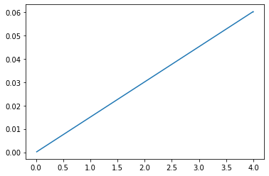
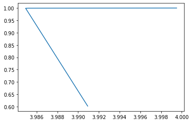
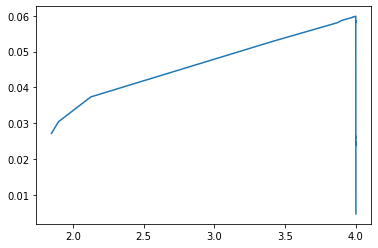
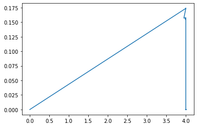
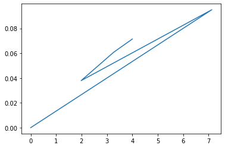
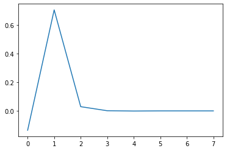

# 玩一玩梯度下降可视化


如果你只会调包，只会import sklearn，本文想让你更进一步，真正动手实现机器学习的算法。发明这些算法的人当然很厉害，但技术就是技术，不会由于过于神秘而不可触碰。既然学了机器学习，为什么不能自己实现算法，那些开源的库，不也是从空白的文件写起的吗？只要你了解部分以下内容，就可以畅通无阻地阅读本文：

-   识别英文单词
-   Python简单语法，numpy简单语法
-   简单的加减乘除，简单的微积分常识

本文探索各种各样梯度下降的运行过程，观察参数变化的规律，以求获得更深的理解。你可以复制我的代码，改改数字，看看算法是怎样运行的，play around & have fun。

本文md源码地址：[AnBlogs](https://github.com/Anarion-zuo/AnBlogs/blob/master/%E5%87%B8%E4%BC%98%E5%8C%96/gradient-visual.md)


本文使用简单的一元线性回归模型举例子，以求简单，$\hat y = \theta x+b$，损失函数和梯度为：
$$
L(\theta,b)=\frac{1}{2}(\theta x+b-y)^2,\frac{\partial L}{\partial \theta}=(\theta x+b-y)x,\frac{\partial L}{\partial b}=\theta x+b-y
$$
如果你对线性回归不了解，且对其有兴趣，请看：[线性回归]()

[TOC]

# 使用的数据

## 准备工作

为了让模型尽量简单，减少运行时间，我使用了人造的数据。产生数据的代码如下：

```python
X = np.arange(0, 100, 1.0)
y = X * 4
```

就是简单的$y=4x$，$x$在$[0,100)$之间取值。

为了记录算法运行的过程，准备两个数组，记录每次循环得到的参数值$\theta,b$：

```python
theta_time = []
bias_time = []
```

可以画出参数经过的轨迹：

```python
plt.plot(theta_time, bias_time)
plt.show()
```

## 标准模型试一下

先使用sklearn的线性回归工具试一下，让心里踏实点。几行代码就能实现：

```python
from sklearn import linear_model
lr = linear_model.LinearRegression()
lr.fit(X.reshape(-1,1), y)
lr.coef_, lr.intercept_
```

得到的结果：

```python
(array([4.]), 0.0)
```

确实符合预期，非常精确。sklearn永远滴神！

# 各种梯度下降尝试

## 初始化

先初始化参数$\theta,b$，暂时初始化为0。

```python
theta = 0
bias = 0
```

学习率暂时初始化为`1e-6`。

```python
rate = 1e-6
```


## Batch梯度下降

这是最原始最简单的梯度下降算法，梯度是所有行计算得到的梯度的平均值。
$$
\nabla_\theta L=\frac{1}{N_D}\sum_i(\theta x^{(i)}+b-y^{(i)})x^{(i)},\nabla_bL=\frac{1}{N_D}\sum_i(\theta x^{(i)}+b-y^{(i)})
$$
计算一次梯度的代码如下，和上式完全对应。

```python
deltaTheta = 0   # theta 分量
deltaBias = 0    # b 分量
for index in range(X.shape[0]):
    leftPart = theta * X[index] - y[index] + bias
    deltaTheta += leftPart * X[index]
    deltaBias += leftPart
deltaTheta /= X.shape[0]
deltaBias /= X.shape[0]
```

得到的`deltaTheta`和`deltaBias`用来更新$\theta,b$：

```python
theta -= deltaTheta * rate
bias -= deltaBias * rate
```

这样就完成了一次迭代中的计算：
$$
\theta^{(k+1)}=\theta^{(k)}-\eta\nabla_\theta L,b^{(k+1)}=b^{(k)}-\eta\nabla_b L,
$$
其中，$\eta$是学习率，就是代码中的`rate`。

最后，判断是否达到循环终止条件：

```python
# 判断参数是否达到预定精度，或是否达到最大循环次数
if np.abs(deltaTheta) < 1e-10 and np.abs(deltaBias) < 1e-15 or iterCount >= 10000:
    # 输出一定信息
    print("iterate times:", iterCount, ", last delta theta:", deltaTheta, ", last delta bias:", deltaBias)
    break
iterCount += 1  # 没达到终止条件，继续跑，并统计循环次数
```

还要在一次循环的末尾统计一下每次循环中参数的值，方便展示参数的变化过程。

```python
theta_time.append(theta)
bias_time.append(bias)
```

这样就完成了一次“训练”啦，把以上代码复制到一起，放进循环，就是完整的代码。

```python
X = np.arange(0, 100, 1.0)
y = X * 4

theta_time = []
bias_time = []

theta = 0
bias = 0

rate = 1e-6
iterCount = 0

while True:
    # 计算梯度
    deltaTheta = 0   # theta 分量
    deltaBias = 0    # b 分量
    for index in range(X.shape[0]):
        leftPart = theta * X[index] - y[index] + bias
        deltaTheta += leftPart * X[index]
        deltaBias += leftPart
    deltaTheta /= X.shape[0]
    deltaBias /= X.shape[0]
    
    # 计算梯度结束，更新参数值
    theta -= deltaTheta * rate
    bias -= deltaBias * rate
    
    # 判断参数是否达到预定精度，或是否达到最大循环次数
    if np.abs(deltaTheta) < 1e-10 and np.abs(deltaBias) < 1e-15 or iterCount >= 10000:
        # 输出一定信息
        print("iterate times:", iterCount, ", last delta theta:", deltaTheta, ", last delta bias:", deltaBias)
        break
    iterCount += 1  # 统计循环次数
    
    theta_time.append(theta)
    bias_time.append(bias)
    
print(theta, bias)   # 输出最终结果

```

最重要的是参数的变化过程，由`theta_time`和`bias_time`两个数组记录。把两个数组的值作图，分别作为横纵坐标，可以观察到$\theta,b$是如何同时变化的。画图代码如下：

```python
plt.plot(theta_time, bias_time)
plt.show()
```

初始化两个参数为0，得到变化过程，从左下角变化到右上角：



print输出信息为：

```
iterate times: 10000 , last delta theta: -3.814528753892911e-09 , last delta bias: 2.530108560570279e-07
```

可以看到，循环是由于超过最大次数而退出的，说明梯度下降的过程还没有完成，算法还没有收敛，存在误差很正常。修改一下，初始化参数为$\theta=4,b=1$，迭代次数为200000，得到变化过程：



print输出信息为：

```
iterate times: 200000 , last delta theta: -2.302357333431649e-08 , last delta bias: 1.527112357045895e-06
theta: 3.984965078037659 bias: 0.9972394290012285
```

最终结果还是存在一定误差，循环还是由于超过最大次数而退出的，没有完成。

## 随机梯度下降

随机梯度下降在数据量较大时较受青睐，梯度是随机抽取一行数据计算得到的，而不是求平均。
$$
i=\text{rand}(0, N_D)\Rightarrow \nabla_\theta L=(\theta x^{(i)}+b-y^{(i)})x^{(i)},\nabla_bL=\theta x^{(i)}+b-y^{(i)}
$$
代码只存在计算梯度部分的不同，计算梯度部分如下：

```python
index = np.random.randint(0, X.shape[0])
leftPart = theta * X[index] - y[index] + bias
deltaTheta = leftPart * X[index] * rate
deltaBias = leftPart * rate
theta -= deltaTheta
bias -= deltaBias
```

设置参数$\theta=0,b=0$，学习率为`1e-4`，迭代次数为100000，得到结果如下：



print输出信息为：

```
iterate times: 100000 , last delta theta: -1.7609025390872246e-07 , last delta bias: -2.934837565145374e-09
theta: 3.999920466001006 bias: 0.004753259914062179
```

虽然循环还是由于达到最大次数而退出的，算法还没有收敛，我们已经看到了$b$参数下降的痕迹。这说明，在Batch梯度下降中，要循环足够多次，让$\theta$完全达到很精确的值后，$b$的梯度才会开始下降。在$\theta$到达某精确值之前，为了使得$\theta$对应的梯度下降，不得不让$b$对应的梯度上升。需要更多的迭代次数才能让算法完全收敛

## 随机梯度下降完全（我的版本）

最彻底的梯度下降算法，学习率应该是由算法确定的。算法寻找一个最佳学习率，使得在这个给定的梯度方向上，函数最小化程度最大。
$$
\eta=\arg\min_\eta(L(\theta^{(k)}-\eta\nabla_\theta L, b^{(k)}-\eta\nabla_bL))
$$
学习率本身不是目的，通过求学习率得到这个梯度方向上的最小值，把每次迭代发挥到极致，才是目的。对于二维的情况，相当于，在下山的时候一直不改变前行方向，直到这个方向开始让自己的高度增加为止。基于这个想法，我自己临场发挥出了一个算法，不知道是否有前人研究过类似的，或是我还没有接触到。当然啦，我自己发挥的算法比不上诸如Backtracking的成熟的算法，放在这里举个例子。

正如上述所说，我的算法是，一直朝着一个方向前进，直到开始变成上坡。要判断何时变为上坡，只需要计算当前所在位置的梯度和前进方向之间的内积，小于零则说明变为上坡。以下是这个算法计算梯度的代码：

```python
index = np.random.randint(0, X.shape[0])    # 随机选一行
# 由于前行方向不变，前行步长不变，可以提前计算
leftPart = theta * X[index] - y[index] + bias
thetaStep = leftPart * rate * X[index]          # theta每次前行的步长
biasStep = leftPart * rate                      # bias每次前行的步长
newTheta = theta
newBias = bias
while True:
    newTheta -= thetaStep                       # theta前行
    newBias -= biasStep                         # bias前行
    leftPart = newTheta * X[index] - y[index] + newBias
    if leftPart * X[index] * thetaStep + leftPart * biasStep < 0:
        # 判断是否变为上坡
        break
    # 记录theta和bias的变化过程
    theta_time.append(newTheta)
    bias_time.append(newBias)
```

设置迭代最大次数为1000，学习率为`1e-5`，参数$\theta=0,b=0$，得到结果如下：



print输出信息：

```
iterate times: 112
theta: 4.000000000000001 bias: -5.6843418860797047e-14
```

收敛速度、精度都有极大提升！

## 随机梯度下降完全（Backtracking）

上面放了我灵机一动得到的算法，这里还是尝试一下经典的Backtracking算法。

算法的思想是，先向前走出一大步，要是步子太大，迈到了上坡部分，就往回缩一些，缩到合适为止。

要先设置好“大步子”和“回缩”：

```python
alpha = .4     # 无关紧要的伸缩常数
beta = .8      # 回缩比例
rate = 1       # 大步子，大的初始学习率
```

算法计算参数、更新梯度部分如下：

```python
index = np.random.randint(0, X.shape[0])  # 随机选择一行计算梯度
newTheta = 0
newBias = 0
leftPart = theta * X[index] - y[index] + bias  # 提前计算好的常数
fx = (theta * X[index] + bias - y[index]) ** 2 # 提前计算好的常数
rate = 1                                       # 每次开始迈步时刷新步长
while True:
    thetaStep = alpha * rate * leftPart * X[index]  # theta迈一大步
    biasStep = alpha * rate * leftPart              # bias迈一大步
    newTheta = theta - thetaStep                    # 计算出新的theta/bias
    newBias = bias - biasStep
    if fx - alpha * rate * (theta ** 2 + bias ** 2) - (newTheta * X[index] + newBias - y[index]) ** 2 >= 0:
        # 检查迈步之后是否跨的太远
        # 不是很远就采用这个步长，退出循环
        # 太远了就缩小一点
        break
    rate *= beta   # 下次迈步子小一点
# 更新参数
theta = newTheta
bias = newBias
```

设置最大迭代次数为100，初始化参数$\theta=0,b=0$，得到结果如下：

```
iterate times: 53
theta: 3.9999918544283117 bias: 0.0039473413680768685
```



收敛迅速，但精度不高。多次尝试，发现和数据的尺度有关。

现改变数据如下：

```python
X = np.arange(0, 10000, 1.0)
y = X * 4
```

得到print输出：

```
iterate times: 26
theta: 3.999999978032292 bias: 0.00011975560136188411
```

具体看一下数据尺度和结果的关系，尝试调整数组`X`的长度为1, 10, 100, 1000, 10000, 100000, 1000000, … 具体造数据代码如下：

```python
for power in range(1, 9, 1):
    X = np.arange(0, 10 ** power, 1.0)
    y = X * 4
    # 下面是计算
    ...
    ...
```

得到$\theta$收敛情况随$10^n$变化如下：



可以看出，$n>2$之后，算法结果差别不大，但是并非没有差别。